# ESP32-C3 Super Mini: Embedded Engineering Guide

이 문서는 ESP32-C3 Super Mini 보드를 활용한 임베디드 시스템 설계 및 디버깅 가이드입니다. 총 6개의 핵심 기능을 통해 RISC-V 아키텍처와 FreeRTOS, 그리고 시스템 안정성 설계 기법을 학습합니다.

---

## 0. 하드웨어 사양 (ESP32-C3 Super Mini)

| 항목 | 상세 사양 | 비고 |
| :--- | :--- | :--- |
| **CPU** | RISC-V 32-bit Single-core | Max 160MHz |
| **Memory** | 400KB SRAM / 4MB Flash | |
| **USB** | Internal USB-Serial/JTAG | GPIO 18(D-), 19(D+) |
| **Wireless** | Wi-Fi 4 + Bluetooth 5 (LE) | |
| **Pinout** | 13x GPIO, 3x ADC, 1x I2C, 1x SPI | |

---

## 1. Machine CSR Access (RISC-V 아키텍처 심화)

### 1.1 RISC-V CSR(Control and Status Registers) 개요
RISC-V 아키텍처에서 CSR은 프로세서의 핵심 제어 및 상태 정보를 담고 있는 특수 목적 레지스터입니다. 일반적인 범용 레지스터(x0~x31)와는 별도의 주소 공간(12비트 주소, 총 4096개 가능)을 가지며, 전용 명령어인 `CSRRR`, `CSRRW`, `CSRRS`, `CSRRC` 등을 통해서만 접근할 수 있습니다.

ESP32-C3는 **Machine Mode**라는 최고 권한 모드에서 동작하며, 이 모드에서 접근 가능한 `m`으로 시작하는 CSR들을 통해 하드웨어의 로우레벨 정보를 직접 제어합니다.

### 1.2 핵심 디버깅 레지스터 상세 분석

| 레지스터 주소 | 이름 | 설명 및 용도 |
| :--- | :--- | :--- |
| `0xB00` | `mcycle` | **Machine Cycle Counter**: 하드웨어 리셋 이후 발생한 클록 사이클의 하위 32비트를 카운트합니다. 코드의 실행 효율을 사이클 단위로 정밀 분석할 때 필수적입니다. |
| `0xB80` | `mcycleh` | `mcycle`의 상위 32비트입니다. 32비트 CPU에서 64비트 카운터 값을 읽기 위해 사용됩니다. |
| `0x301` | `misa` | **Machine ISA Register**: 현재 CPU가 지원하는 명령어 집합(Instruction Set Architecture) 정보를 담고 있습니다. |
| `0xB02` | `minstret` | **Machine Instructions Retired**: 실제로 성공적으로 실행 완료된 명령어의 수를 카운트합니다. 파이프라인 효율 분석에 사용됩니다. |
| `0xF14` | `mhartid` | **Hardware Thread ID**: 현재 코어의 ID를 나타냅니다. (ESP32-C3는 싱글코어이므로 항상 0) |

### 1.3 mcycle을 활용한 정밀 성능 측정 메커니즘
일반적인 `micros()` 함수는 하드웨어 타이머 인터럽트를 기반으로 동작하므로 오차가 발생할 수 있습니다. 반면 `mcycle`은 CPU 클록과 1:1로 동기화되어 있어 가장 정밀한 측정이 가능합니다.

#### 성능 측정 흐름도 (Detailed)
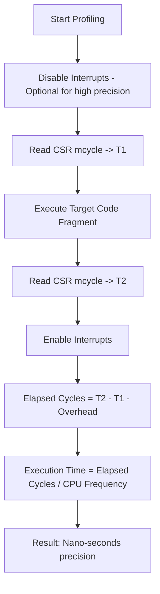

### 1.4 인라인 어셈블리(Inline Assembly) 심층 이해
C/C++ 코드 내에서 CSR에 접근하려면 GCC의 확장 인라인 어셈블리 문법을 사용해야 합니다.

```cpp
uint32_t count;
__asm__ __volatile__ (
    "csrr %0, mcycle"  // 명령어: Read CSR mcycle into output operand 0
    : "=r"(count)      // Output operand: %0은 count 변수에 매핑됨 (r: register)
    :                  // Input operands: 없음
    : "memory"         // Clobbers: 메모리 배리어를 설정하여 컴파일러 최적화 방지
);
```
*   `__volatile__`: 컴파일러가 이 코드를 최적화 과정에서 삭제하거나 위치를 옮기지 않도록 강제합니다.
*   `csrr`: CSR Read 전용 의사 명령어(Pseudo-instruction)입니다.

### 1.5 64비트 카운터 처리 (32비트 환경)
ESP32-C3는 32비트 CPU이므로 `mcycle`은 약 26초(160MHz 기준)면 오버플로우가 발생합니다. 더 긴 시간 측정을 위해서는 상위 레지스터인 `mcycleh`를 조합해야 합니다.

**64비트 읽기 알고리즘:**
1. `mcycleh`를 읽음 (H1)
2. `mcycle`을 읽음 (L)
3. 다시 `mcycleh`를 읽음 (H2)
4. H1과 H2가 같다면 (H1 << 32 | L) 반환. 다르다면 1번부터 반복 (읽는 도중 하위 비트에서 상위 비트로 캐리(Carry)가 발생한 경우 대비)

### 1.6 실무 활용 예시
*   **알고리즘 최적화**: 특정 수식 계산이 몇 사이클을 소모하는지 비교하여 최적의 알고리즘 선택.
*   **I/O 응답 속도 측정**: `digitalWrite`가 호출된 후 실제 핀 전압이 변하기까지의 사이클 수 계산.
*   **인터럽트 지연 시간(Latency) 분석**: 하드웨어 이벤트 발생 후 인터럽트 서비스 루틴(ISR)에 진입하기까지의 소요 사이클 측정.

### 1.7 IPC(Instructions Per Cycle) 분석
`mcycle`과 `minstret`을 함께 읽으면 코드의 파이프라인 효율을 수치로 평가할 수 있습니다.

```
IPC = minstret_delta / mcycle_delta
```

*   **IPC ≈ 0.8~0.95**: 잘 최적화된 정수 연산 루프. ADD/MUL이 파이프라인을 효율적으로 채움.
*   **IPC ≈ 0.4~0.7**: 분기, 메모리 접근, 함수 호출 오버헤드가 포함된 일반적인 C 코드.
*   **IPC < 0.1**: Flash 캐시 미스가 심하거나 파이프라인 정지(Pipeline Stall)가 빈번한 코드.

ESP32-C3의 단일 발행(Single-issue) RISC-V 코어에서는 이론적 IPC 최대치가 1.0입니다.

예시 출력:
```
[sum(1~1000)]  result=500500   cycles=3421   instrs=2810   time=21.4 ns  IPC=0.82
[mac(1~20) ]   result=...      cycles=1240   instrs=912    time=7.8 ns   IPC=0.74
```

### 1.8 프로파일링 헬퍼 패턴
매번 CSR을 직접 읽는 코드를 반복하는 대신, 시작점의 스냅샷을 구조체로 묶어 관리하면 코드가 간결해집니다.

```cpp
typedef struct {
    uint32_t cycles;
    uint32_t instrs;
} PerfSample;

static PerfSample profile_begin(void) {
    return (PerfSample){
        .cycles = csr_mcycle(),
        .instrs = csr_minstret()
    };
}
// 사용: PerfSample s = profile_begin(); ... profile_end(s, "label", result);
```

`__volatile__` 키워드와 `"memory"` clobber를 반드시 명시해야 컴파일러가 CSR 읽기 순서를 재배치하지 않습니다.


---

## 2. UART & Internal USB-Serial/JTAG (하드웨어 디버깅 핵심)

### 2.1 통합 컨트롤러의 혁신
과거의 ESP32나 다른 MCU들은 PC와 통신하기 위해 외부 USB-to-UART 칩(예: CP2102, CH340)이 필요했습니다. 하지만 ESP32-C3는 **내장 USB-Serial/JTAG Controller**를 탑재하여, USB D+/D- 선을 칩의 GPIO 18/19에 직접 연결하는 것만으로 두 가지 강력한 기능을 동시에 수행합니다.

1.  **USB-Serial (CDC)**: 표준 시리얼 포트로 인식되어 `Serial.print()` 및 펌웨어 다운로드에 사용됩니다.
2.  **USB-JTAG**: 별도의 하드웨어 디버거(ESP-Prog 등) 없이 GDB를 통한 실시간 하드웨어 디버깅을 지원합니다.

### 2.2 내부 구조 및 신호 흐름
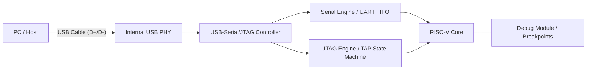

### 2.3 인터페이스 비교 및 선택 가이드

| 비교 항목 | 내장 USB-Serial/JTAG | 하드웨어 UART0 |
| :--- | :--- | :--- |
| **물리적 핀** | GPIO 18 (D-), 19 (D+) | GPIO 20 (RX), 21 (TX) |
| **속도** | USB Full Speed (12Mbps) | 보드 레이트 설정에 의존 (최대 5Mbps) |
| **장점** | 추가 부품 불필요, JTAG 디버깅 가능 | 부팅 로그(ROM Bootloader) 고정 출력 |
| **단점** | Deep Sleep 시 USB 연결 끊김 | 외부 USB-TTL 컨버터 필수 |
| **추천 용도** | 일반적인 개발 및 실시간 디버깅 | 외부 통신 모듈(GPS, GSM) 연동 |

### 2.4 JTAG 디버깅 워크플로우
내장 컨트롤러를 통해 소스 코드의 특정 라인에서 멈추거나 변수 값을 실시간으로 수정할 수 있습니다.

1.  **OpenOCD 실행**: `openocd -f board/esp32c3-builtin.cfg` 명령으로 PC와 C3 간의 디버그 채널을 엽니다.
2.  **GDB 연결**: `riscv32-esp-elf-gdb`를 실행하여 OpenOCD 서버에 접속합니다.
3.  **동작 제어**:
    *   `break setup`: `setup()` 함수 시작점에 중단점 설정.
    *   `continue`: 프로그램 실행.
    *   `print var_name`: 변수 값 확인.

### 2.5 하드웨어 연결 주의사항
*   **직결 가능**: ESP32-C3 Super Mini 보드는 대개 USB 커넥터가 이 핀들에 이미 연결되어 있습니다.
*   **전압 레벨**: USB D+/D- 신호는 표준 USB 레벨을 따르며, 내부 PHY가 이를 처리합니다.
*   **GPIO 제약**: USB 기능을 사용할 때 GPIO 18, 19는 일반 I/O로 사용하지 않는 것이 권장됩니다. 만약 일반 I/O로 재정의하면 USB 연결이 끊겨 펌웨어 업로드가 어려워질 수 있습니다. (이 경우 Boot 버튼을 누른 채 리셋하여 다운로드 모드 진입 필요)

### 2.6 실무 디버깅 팁
*   **Serial.flush()**: 시스템 패닉 발생 직전의 로그를 확인하려면 `Serial.flush()`를 호출하여 버퍼의 데이터를 강제로 전송해야 합니다.
*   **에코백(Echo-back) 테스트**: `Serial.available()`과 `Serial.read()`를 조합하여 터미널과의 통신 상태를 상시 점검하는 루틴을 포함하는 것이 좋습니다.

### 2.7 ESP_LOG 레벨 체계
ESP-IDF는 5가지 로그 레벨을 제공하며, `idf.py monitor`에서 색상으로 구분됩니다.

| 함수 | 레벨 | 색상 | 용도 |
| :--- | :--- | :--- | :--- |
| `ESP_LOGE()` | ERROR | 빨강 | 복구 불가한 오류 |
| `ESP_LOGW()` | WARN | 노랑 | 비정상적이지만 치명적이지 않은 상황 |
| `ESP_LOGI()` | INFO | 초록 | 일반 동작 상태 |
| `ESP_LOGD()` | DEBUG | 흰색 | 개발 중 상세 정보 (배포 시 제거 권장) |
| `ESP_LOGV()` | VERBOSE | 흰색 | 극세밀 추적용 |

`menuconfig → Component config → Log output → Default log verbosity`에서 빌드 시 컷오프 레벨을 설정합니다. 설정 레벨보다 낮은 로그는 **전처리기 단계에서 완전히 제거**되어 Flash 용량과 CPU를 절약합니다.

### 2.8 UART 드라이버 기반 에코백 구현
USB-CDC 포트에서 수신 데이터를 처리하려면 `uart_driver_install()`로 내부 링 버퍼를 활성화한 후 `uart_read_bytes()`를 사용합니다.

```cpp
uart_config_t cfg = {
    .baud_rate = 115200,
    .data_bits = UART_DATA_8_BITS,
    .parity    = UART_PARITY_DISABLE,
    .stop_bits = UART_STOP_BITS_1,
    .flow_ctrl = UART_HW_FLOWCTRL_DISABLE,
};
uart_param_config(UART_NUM_0, &cfg);
uart_driver_install(UART_NUM_0, 512 * 2, 0, 0, NULL, 0);

// 비블로킹 수신 (50 ms 타임아웃)
uint8_t buf[64];
int len = uart_read_bytes(UART_NUM_0, buf, sizeof(buf) - 1, pdMS_TO_TICKS(50));
if (len > 0) {
    uart_write_bytes(UART_NUM_0, (const char *)buf, len);  // 에코
}
```

`uart_wait_tx_done(port, timeout)` — `Serial.flush()`에 해당하는 ESP-IDF API입니다. 슬립 진입 또는 패닉 유발 코드 직전에 반드시 호출하여 UART FIFO를 비워야 마지막 로그가 잘리지 않습니다.

---

## 3. FreeRTOS Tasks (싱글 코어 멀티태스킹 전략)

### 3.1 ESP32-C3와 싱글 코어 FreeRTOS
전형적인 ESP32(듀얼 코어)와 달리, ESP32-C3는 **단일 RISC-V 코어**를 가집니다. 이는 동시에 물리적으로 두 개의 코드가 실행될 수 없음을 의미하며, FreeRTOS 스케줄러가 매우 짧은 시간 간격으로 CPU 점유권을 태스크 간에 교체(Context Switching)하여 마치 동시에 돌아가는 것처럼 보이게 합니다.

### 3.2 선점형 스케줄링(Preemptive Scheduling) 상세
FreeRTOS는 기본적으로 우선순위 기반 선점형 스케줄링을 사용합니다.

*   **Tick Interrupt**: 하드웨어 타이머가 주기적(기본 1ms)으로 인터럽트를 발생시켜 스케줄러를 깨웁니다.
*   **Context Switching**: 현재 실행 중인 태스크의 레지스터 상태를 스택에 저장하고, 다음 우선순위 태스크의 상태를 복구합니다.
*   **Starvation (기아 현상)**: 높은 우선순위의 태스크가 CPU를 양보(`vTaskDelay` 등)하지 않으면, 낮은 우선순위 태스크는 영원히 실행되지 못할 수 있습니다.

### 3.3 태스크 제어 블록(TCB)과 메모리 구조
각 태스크는 커널 내부에서 **TCB (Task Control Block)**로 관리됩니다.

| 항목 | 설명 | 관리 위치 |
| :--- | :--- | :--- |
| **Stack** | 로컬 변수, 함수 호출 기록, ISR 복귀 주소 저장 | RAM (Heap 할당) |
| **Priority** | 0(IDLE) ~ configMAX_PRIORITIES-1 | TCB 내 저장 |
| **State** | Ready, Running, Blocked, Suspended | 커널 리스트에서 관리 |
| **Handle** | 태스크 제어를 위한 포인터 | 사용자 코드 변수 |

### 3.4 실전 태스크 설계 패턴
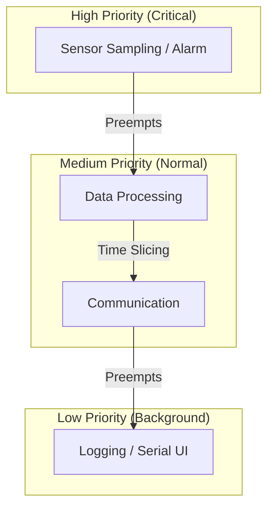

### 3.5 스택 사이즈 최적화 및 디버깅
ESP32-C3는 RAM이 400KB로 제한적이므로 무분별한 스택 할당은 위험합니다.

1.  **High Water Mark**: `uxTaskGetStackHighWaterMark()` 함수를 사용하여 태스크 실행 중 남은 최소 스택 공간을 확인합니다. 0에 가까워지면 `Stack Overflow`가 발생합니다.
2.  **Stack Overflow Hook**: `FreeRTOSConfig.h`에 설정된 훅 함수를 통해 오버플로우 발생 시 즉시 감지하고 로그를 남길 수 있습니다.

### 3.6 싱글 코어 주의사항: Critical Sections
싱글 코어에서는 인터럽트를 비활성화하는 것만으로 완벽한 **Critical Section**을 만들 수 있습니다. 듀얼 코어에서 사용하는 `Spinlock`은 필요하지 않지만, ISR(Interrupt Service Routine)과 태스크 간 공유 변수 접근 시에는 반드시 `portENTER_CRITICAL()` 등을 사용하여 원자성(Atomicity)을 보장해야 합니다.

### 3.7 주요 API 심화 활용
*   **vTaskDelay vs delayMicroseconds**: `vTaskDelay`는 CPU 점유권을 반납하고 Blocked 상태로 들어가지만, `delayMicroseconds`는 CPU를 붙잡고 있는 Busy-waiting 방식입니다. RTOS 환경에서는 가급적 전자를 사용해야 시스템 효율이 높아집니다.
*   **vTaskDelete(NULL)**: 태스크가 자신의 할 일을 끝내면 반드시 자기 자신을 삭제하여 할당된 메모리를 해제해야 합니다.

### 3.8 실전 3계층 태스크 설계 예시
3.4의 이론을 코드로 구현하면 다음 구조가 됩니다.

| 태스크 | 역할 | 우선순위 | 스택 | vTaskDelay |
| :--- | :--- | :--- | :--- | :--- |
| `Sensor` | GPIO 폴링, 임계값 감시 | 10 (High) | 2048 bytes | 200 ms |
| `Process` | 데이터 연산, 필터링 | 5 (Mid) | 2048 bytes | 50 ms |
| `Logger` | 시리얼 출력, 통계 표시 | 1 (Low) | 3072 bytes | 2000 ms |

Logger에 3072 bytes를 할당하는 이유는 `printf()`와 `vTaskList()` 내부에서 상당한 스택을 소모하기 때문입니다. 부족하면 Stack Overflow 없이 조용히 잘못된 동작을 일으키므로 High Water Mark로 반드시 확인해야 합니다.

### 3.9 런타임 태스크 모니터링 (vTaskList)
`vTaskList()`는 현재 실행 중인 모든 태스크의 상태를 텍스트로 반환합니다.

```cpp
char task_list[512];
vTaskList(task_list);
printf("Name\t\tState\tPrio\tStack\tNum\n%s\n", task_list);
```

상태 코드: `R`=Running, `B`=Blocked, `S`=Suspended, `D`=Deleted, `I`=Ready

출력 예시:
```
Name            State   Prio    Stack   Num
Sensor          B       10      1820    4
Process         B       5       1680    5
Logger          R       1       2300    6
Monitor         B       2       2100    7
IDLE            R       0       988     3
```

> **활성화 조건**: `sdkconfig`에서 `CONFIG_FREERTOS_USE_TRACE_FACILITY=y`와 `CONFIG_FREERTOS_USE_STATS_FORMATTING_FUNCTIONS=y`가 설정되어야 합니다.

---

## 4. FreeRTOS Queues (안전한 태스크 간 데이터 통신)

### 4.1 큐(Queue)의 핵심 개념과 필요성
멀티태스킹 환경에서 두 태스크가 공유 변수(Global Variable)를 통해 데이터를 주고받으면, 한 태스크가 데이터를 쓰는 도중에 다른 태스크가 이를 읽으려 할 때 **데이터 부패(Data Corruption)**가 발생할 수 있습니다. FreeRTOS 큐는 커널이 관리하는 FIFO(First-In, First-Out) 버퍼로, 접근 시 원자성(Atomicity)을 보장하여 안전한 통신 통로를 제공합니다.

### 4.2 데이터 전달 방식: Pass-by-Copy
FreeRTOS 큐는 데이터를 **복사(Copy)**하여 저장합니다.

*   **동작 방식**: 데이터를 보낼 때 송신자 태스크의 로컬 변수 값이 큐 버퍼로 복사되고, 수신자 태스크가 읽을 때 다시 큐 버퍼에서 수신자의 로컬 변수로 복사됩니다.
*   **장점**: 송신 태스크가 데이터를 보낸 직후 해당 변수를 수정하거나 파괴해도 큐에 저장된 데이터는 안전합니다. (포인터만 보내는 경우 발생할 수 있는 메모리 해제 이슈 방지)
*   **주의**: 매우 큰 구조체(예: 1KB 이상의 배열)를 통째로 큐에 넣으면 복사 비용(CPU 사이클)이 커지므로, 이런 경우엔 데이터가 담긴 버퍼의 **포인터**만 큐로 전달하는 방식을 권장합니다.

### 4.3 큐의 상태와 블로킹(Blocking) 메커니즘
큐는 송수신 시 대기 시간(Ticks to Wait)을 설정할 수 있습니다.

| 상태 | 설명 | 태스크 동작 |
| :--- | :--- | :--- |
| **Queue Full** | 큐가 가득 참 | 송신 태스크는 지정된 시간 동안 `Blocked` 상태로 대기하거나 포기 |
| **Queue Empty** | 큐가 비어 있음 | 수신 태스크는 데이터가 들어올 때까지 `Blocked` 상태로 대기 |
| **Available** | 데이터가 존재함 | 수신 태스크가 즉시 데이터를 가져가고 실행 지속 |

### 4.4 ISR(인터럽트)에서의 큐 사용 주의사항
인터럽트 서비스 루틴(ISR) 내에서는 일반 `xQueueSend` 함수를 사용할 수 없습니다. ISR은 스케줄러를 멈추거나 대기(Block)할 수 없기 때문입니다.

*   **FromISR 계열 함수**: `xQueueSendFromISR`, `xQueueReceiveFromISR`를 사용해야 합니다.
*   **Yield Request**: ISR에서 높은 우선순위 태스크를 깨웠다면, ISR 종료 시 `portYIELD_FROM_ISR()`를 호출하여 즉시 컨텍스트 스위칭이 일어나도록 유도해야 합니다.

### 4.5 큐 설계 시각화
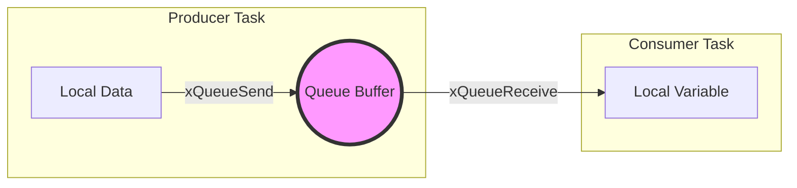

### 4.6 실무 설계 팁: 데이터 구조체 설계
복잡한 시스템에서는 단순히 정수(int)를 보내는 대신, 데이터 타입과 값을 포함한 구조체를 정의하여 사용합니다.

```cpp
typedef struct {
    uint8_t sensor_id;
    float value;
    uint32_t timestamp;
} SensorData_t;

// 큐 생성 예시
QueueHandle_t xQueue = xQueueCreate(10, sizeof(SensorData_t));
```

이렇게 하면 하나의 수신 태스크가 여러 종류의 센서 데이터를 효율적으로 식별하고 처리할 수 있습니다.

### 4.7 다중 프로듀서 패턴
하나의 큐를 여러 태스크가 동시에 사용할 수 있습니다. 소비자(Consumer)는 `sensor_id` 필드를 보고 데이터 출처를 구분하므로, 센서마다 별도 큐를 만들 필요가 없습니다.

```cpp
// 세 센서가 동일한 큐에 전송 (각자 다른 주기)
xTaskCreate(producer_task, "Temp",  2048, (void*)SENSOR_TEMP,  4, NULL);  // 500 ms
xTaskCreate(producer_task, "Humid", 2048, (void*)SENSOR_HUMID, 4, NULL);  // 1000 ms
xTaskCreate(producer_task, "Press", 2048, (void*)SENSOR_PRESS, 4, NULL);  // 2000 ms
```

프로듀서마다 전송 주기가 달라도 소비자는 도착 순서대로(FIFO) 처리합니다.

### 4.8 큐 포화 방어 코드
`portMAX_DELAY` 대신 유한한 타임아웃을 설정하면 큐가 가득 찼을 때 무한 블로킹을 방지합니다.

```cpp
if (xQueueSend(queue, &pkt, pdMS_TO_TICKS(50)) != pdTRUE) {
    // 50 ms 안에 공간이 생기지 않으면 패킷 드롭
    dropped++;
    ESP_LOGW(TAG, "Queue full — dropped %u", dropped);
}
```

`uxQueueMessagesWaiting(queue)`로 현재 큐에 쌓인 항목 수를 실시간 확인할 수 있습니다. 이 값이 지속적으로 큐 최대 깊이에 근접하면, 소비자의 처리 속도가 프로듀서를 따라가지 못하고 있다는 신호입니다.

---

## 5. Task Watchdog Timer (TWDT: 시스템 안정성 및 자가 회복)

### 5.1 왜 와치독(Watchdog)이 필요한가?
임베디드 시스템은 24시간 365일 중단 없이 동작해야 합니다. 하지만 예기치 못한 하드웨어 노이즈, 메모리 누수, 혹은 잘못된 논리 루프로 인한 **데드락(Deadlock)** 상태에 빠질 수 있습니다. 와치독은 시스템의 생존 여부를 감시하다가, 정해진 시간 내에 "생존 신호(Feeding)"가 오지 않으면 강제로 하드웨어를 리셋시켜 시스템을 초기화합니다.

### 5.2 ESP32-C3의 와치독 계층 구조
ESP32-C3에는 여러 단계의 보호막이 존재합니다.

| 종류 | 감시 대상 | 동작 결과 |
| :--- | :--- | :--- |
| **MWDT (Main WDT)** | 하드웨어 타이머 / 시스템 전체 | 하드웨어 강제 리셋 |
| **TWDT (Task WDT)** | 개별 FreeRTOS 태스크 | 패닉 리포트 출력 후 리셋 (선택 가능) |
| **RTC WDT** | 저전력 모드 / 핵심 시스템 | 최후의 수단으로 시스템 완전 재시작 |

### 5.3 Task WDT의 동작 원리: 구독(Subscription) 모델
TWDT는 단순히 하나의 타이머가 아니라, 여러 태스크를 동시에 감시할 수 있는 "구독형" 서비스입니다.

1.  **초기화**: TWDT 서비스 시작 및 타임아웃 시간(예: 5초) 설정.
2.  **구독**: 감시가 필요한 중요한 태스크들이 자기 자신을 TWDT에 등록(`esp_task_wdt_add`).
3.  **체크인**: 각 태스크는 루프를 돌 때마다 "나 살아있음"을 알림(`esp_task_wdt_reset`).
4.  **심판**: **모든** 등록된 태스크가 제시간에 체크인해야만 타이머가 초기화됩니다. 단 하나라도 늦으면 시스템은 장애로 판단합니다.

### 5.4 시스템 장애 진단 플로우
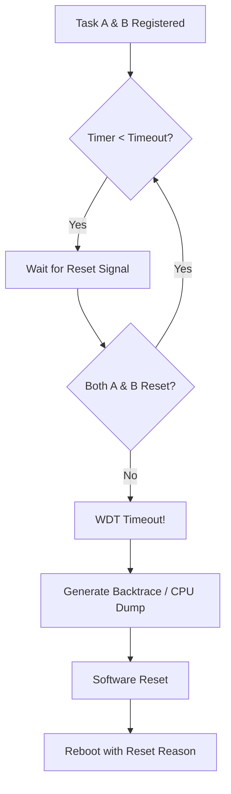

### 5.5 패닉 핸들링과 디버깅 (Panic Report)
WDT에 의해 리셋이 발생하면, ESP32-C3는 부팅 직후 시리얼 포트를 통해 **Backtrace** 정보를 쏟아냅니다.

*   **Guru Meditation Error**: 시스템 패닉 상태를 알리는 메시지입니다.
*   **Reason: Task Watchdog got triggered**: 어떤 사유로 리셋되었는지 명시합니다.
*   **PC (Program Counter)**: 리셋 직전에 CPU가 실행 중이던 코드 주소입니다. 이를 통해 어떤 함수의 어떤 줄에서 무한 루프가 발생했는지 역추적할 수 있습니다.

### 5.6 실무 설계 권장사항
*   **우선순위 고려**: 낮은 우선순위 태스크가 CPU를 점유하지 못해 WDT가 터지는 경우가 많습니다. 높은 우선순위 태스크에는 반드시 `vTaskDelay`를 적절히 배치해야 합니다.
*   **핵심 작업만 감시**: UI 업데이트나 로그 출력 같은 비핵심 작업은 WDT 감시 대상에서 제외하여 불필요한 리셋을 방지합니다.
*   **I/O 차단 방지**: 외부 센서 응답을 무한정 기다리는 코드(`while(wait_sensor)`)는 반드시 타임아웃 처리를 하여 WDT가 작동하기 전에 스스로 복구하게 해야 합니다.

### 5.7 리셋 원인 감지 (esp_reset_reason)
WDT가 발생한 후 재부팅되면 `esp_reset_reason()`으로 원인을 확인하여 정상 부팅과 장애 복구 부팅을 구분할 수 있습니다.

```cpp
#include "esp_system.h"

esp_reset_reason_t r = esp_reset_reason();
if (r == ESP_RST_TASK_WDT) {
    ESP_LOGE(TAG, "!!! TWDT fired last boot — check for hung task !!!");
    // 예: 장애 카운터 증가, NVS에 진단 로그 저장
}
```

| 원인 상수 | 설명 |
| :--- | :--- |
| `ESP_RST_POWERON` | 최초 전원 인가 |
| `ESP_RST_SW` | `esp_restart()` 호출 |
| `ESP_RST_PANIC` | Guru Meditation 패닉 |
| `ESP_RST_INT_WDT` | 인터럽트 WDT |
| `ESP_RST_TASK_WDT` | 태스크 WDT (TWDT) |
| `ESP_RST_DEEPSLEEP` | Deep-sleep 웨이크업 |
| `ESP_RST_BROWNOUT` | 전압 강하(갈색 아웃) |

### 5.8 의도적 행(Hang) 시뮬레이션 패턴
WDT 동작을 실습하려면 특정 조건에서 `esp_task_wdt_reset()` 호출을 중단하는 코드를 삽입합니다.

```cpp
static volatile bool g_hang = false;

void task_b(void *arg) {
    esp_task_wdt_add(NULL);
    while (1) {
        if (g_hang) {
            /* CPU를 바쁘게 유지하면서 체크인을 중단 — 
               WDT_TIMEOUT 초 후 패닉 발생 및 시스템 리셋 */
            while (1) { volatile int x = 0; for(int i=0;i<1000000;i++) x++; }
        }
        esp_task_wdt_reset();
        vTaskDelay(pdMS_TO_TICKS(1000));
    }
}
```

**핵심**: TWDT는 "모든 등록된 태스크가 체크인해야 한다"는 AND 조건입니다. 태스크 B가 행(Hang) 상태라면 태스크 A가 아무리 `esp_task_wdt_reset()`을 호출해도 WDT가 발동됩니다.

ESP-IDF v5.x에서는 초기화 API가 변경되었습니다:
```cpp
const esp_task_wdt_config_t cfg = {
    .timeout_ms    = 5000,
    .idle_core_mask = 0,
    .trigger_panic  = true,
};
esp_task_wdt_init(&cfg);
```

---

## 6. Low Power & Deep Sleep (저전력 설계와 에너지 최적화)

### 6.1 임베디드 에너지 관리의 핵심: 전력 도메인
ESP32-C3는 전력 효율을 극대화하기 위해 시스템을 여러 개의 **전력 도메인(Power Domains)**으로 분리하여 설계되었습니다. 가장 중요한 개념은 **System Domain**과 **RTC Domain**의 분리입니다.

*   **System Domain**: CPU, RAM, 대부분의 디지털 주변장치(SPI, I2C, Wi-Fi 등)를 포함합니다.
*   **RTC Domain**: 초저전력 타이머, RTC 컨트롤러, 그리고 슬립 중에도 데이터를 저장할 수 있는 소량의 **RTC RAM**을 포함합니다.

### 6.2 슬립 모드별 상세 비교

| 모드 | CPU | Wi-Fi/BT | RTC 도메인 | 전력 소모 (Typ.) | 복구 방식 |
| :--- | :--- | :--- | :--- | :--- | :--- |
| **Active** | ON | ON | ON | 20 ~ 130 mA | - |
| **Modem-sleep** | ON | OFF | ON | 15 ~ 25 mA | 즉시 활성화 |
| **Light-sleep** | Pause | OFF | ON | 0.3 ~ 0.8 mA | 실행 지점부터 재개 |
| **Deep-sleep** | OFF | OFF | ON | **5 ~ 10 μA** | **시스템 리셋(Reset)** |
| **Hibernation** | OFF | OFF | Only Timer | 1 ~ 3 μA | 시스템 리셋 |

### 6.3 Deep Sleep 메커니즘과 부트 시퀀스
Deep Sleep은 단순히 전원을 끄는 것이 아니라, 시스템의 상태를 최소한으로 유지하며 "잠드는" 과정입니다.

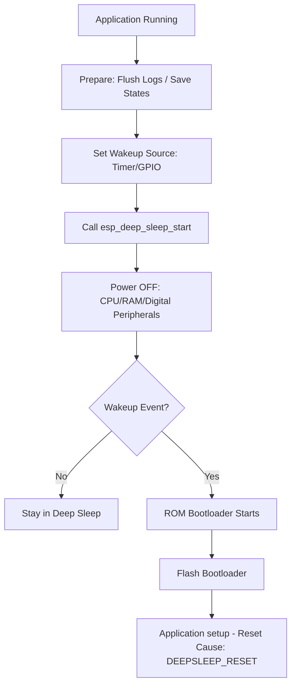

### 6.4 데이터 유지 전략: RTC 메모리 활용
Deep Sleep에 진입하면 일반 SRAM의 모든 데이터는 소실됩니다. 하지만 잠에서 깨어났을 때 이전의 상태(예: 센서 데이터 카운트, 네트워크 연결 정보)를 유지해야 할 경우가 있습니다.

*   **RTC DATA ATTR**: `RTC_DATA_ATTR` 속성을 변수 선언 시 사용하면, 해당 변수는 RTC RAM에 배치되어 슬립 중에도 값이 보존됩니다.
    ```cpp
    RTC_DATA_ATTR int bootCount = 0; // 슬립 후에도 초기화되지 않음
    ```
*   **외부 플래시 저장**: 데이터량이 많거나 전원이 완전히 차단될 가능성이 있다면 **NVS (Non-volatile Storage)**를 사용하여 플래시 메모리에 영구 저장해야 합니다.

### 6.5 웨이크업 소스(Wakeup Sources)
1.  **Timer Wakeup**: 가장 일반적인 방식으로, 설정된 시간이 지나면 깨어납니다. (us 단위 설정)
2.  **GPIO Wakeup**: 버튼 클릭이나 센서 신호(High/Low)를 감지하여 깨어납니다. (ESP32-C3는 특정 RTC GPIO 핀 사용 가능)

### 6.6 저전력 설계 실무 팁
*   **Floating Pins 방지**: 슬립 진입 전 GPIO 상태가 플로팅(Floating)되지 않도록 풀업/풀다운 설정을 명확히 해야 누설 전류를 막을 수 있습니다.
*   **Peripherals 종료**: 외부 센서나 디스플레이 전원을 제어할 수 있는 FET 회로를 구성하고, 슬립 전 반드시 OFF 신호를 주어야 합니다.
*   **Serial Flush**: 슬립 진입 직전에 로그를 남기려면 반드시 `Serial.flush()`를 호출하여 UART FIFO 버퍼가 비워질 때까지 기다려야 합니다. 그렇지 않으면 로그가 잘린 채 잠들게 됩니다.

### 6.7 웨이크업 원인 감지 API
Deep-sleep에서 깨어난 후 `esp_sleep_get_wakeup_cause()`로 어떤 이벤트가 시스템을 깨웠는지 구분합니다.

```cpp
esp_sleep_wakeup_cause_t cause = esp_sleep_get_wakeup_cause();
switch (cause) {
case ESP_SLEEP_WAKEUP_TIMER:
    printf("Timer wakeup\n");    break;
case ESP_SLEEP_WAKEUP_GPIO:
    printf("GPIO wakeup\n");     break;
case ESP_SLEEP_WAKEUP_UNDEFINED:
    printf("First boot\n");      break;  // 슬립에서 깨어난 것이 아님
}
```

Light-sleep에서는 `esp_sleep_get_wakeup_cause()` 대신 `esp_light_sleep_start()`의 반환값으로 판단합니다.

### 6.8 GPIO 웨이크업 전체 설정 흐름
버튼이나 외부 센서 신호로 ESP32-C3를 깨우려면 다음 세 단계가 필요합니다.

```cpp
// 1. GPIO 설정: 풀업 + 입력 모드
gpio_config_t io = {
    .pin_bit_mask = (1ULL << WAKEUP_PIN),
    .mode         = GPIO_MODE_INPUT,
    .pull_up_en   = GPIO_PULLUP_ENABLE,
};
gpio_config(&io);

// 2. GPIO 웨이크업 활성화 (LOW 레벨 = 버튼 눌림)
esp_sleep_enable_gpio_wakeup();
gpio_wakeup_enable(WAKEUP_PIN, GPIO_INTR_LOW_LEVEL);

// 3. 타이머 백업 소스 (버튼 없이도 N초 후 깨어남)
esp_sleep_enable_timer_wakeup(10 * 1000000ULL);  // 10초

esp_deep_sleep_start();  // 이 줄 이후 코드는 절대 실행되지 않음
```

**제약**: ESP32-C3에서 GPIO Deep-sleep 웨이크업은 GPIO 0~5와 GPIO 9(BOOT 버튼)만 지원합니다. 일반 GPIO(예: GPIO 10~21)는 웨이크업 소스로 사용할 수 없습니다.

---

---

## 7. Race Condition & Mutex (공유 자원 경합과 상호 배제)

### 7.1 데이터 부패의 근본 원인: Race Condition
많은 엔지니어들이 "싱글 코어에서는 한 번에 하나의 코드만 실행되니 경합(Race)이 발생하지 않는다"고 오해합니다. 하지만 FreeRTOS와 같은 멀티태스킹 환경에서는 **타임 슬라이싱(Time-slicing)**에 의해 어느 시점에서든 컨텍스트 스위칭이 발생할 수 있습니다. 

특히 `count++`와 같은 "Read-Modify-Write" 연산 도중에 태스크가 교체되면 데이터가 유실되는 현상이 발생합니다.

### 7.2 RISC-V 어셈블리 레벨 분석
`shared_counter++` 코드가 실제로 CPU에서 어떻게 실행되는지 RISC-V 명령어로 분해해 보면 그 위험성이 명확해집니다.

| 단계 | 명령어 | 역할 | 비고 |
| :--- | :--- | :--- | :--- |
| **1. Load** | `lw a5, 0(s1)` | 메모리(RAM)의 변수 값을 CPU 레지스터(`a5`)로 로드 | |
| **2. Add** | `addi a5, a5, 1` | 레지스터 값을 1 증가 | **여기서 스위칭 발생 시 문제** |
| **3. Store** | `sw a5, 0(s1)` | 계산된 값을 다시 메모리(RAM)에 저장 | |

**장애 시나리오:**
1.  **태스크 A**가 1단계(Load)를 수행하여 레지스터에 `10`을 담음.
2.  **태스크 A**가 2단계(Add) 수행 직후 인터럽트에 의해 **태스크 B**로 교체됨.
3.  **태스크 B**가 `shared_counter`를 읽어 11로 만들고 저장함.
4.  다시 **태스크 A**가 복귀하여 자신의 레지스터 값(`11`)을 메모리에 씀.
5.  결과: 두 번 증가했어야 할 값이 `11`에 머무름 (**Data Loss**).

### 7.3 컨텍스트 스위칭 시각화
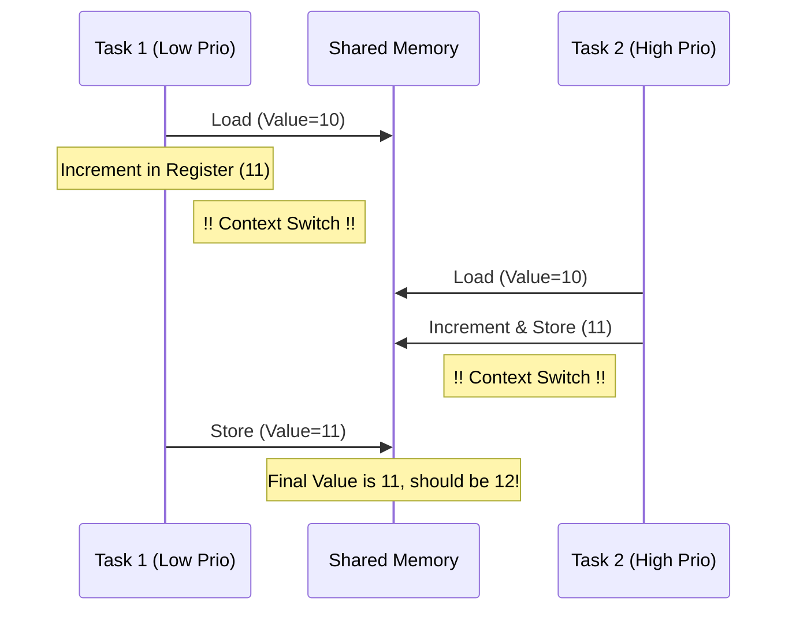

### 7.4 Mutex: 소프트웨어 기반 상호 배제
Mutex는 **"이 코드 구간은 한 번에 하나만 들어올 수 있다"**는 약속입니다. FreeRTOS 커널은 Mutex를 요청한 태스크가 이를 획득하지 못하면 즉시 `Blocked` 상태로 전환시켜 CPU 자원을 낭비하지 않게 관리합니다.

### 7.5 동기화 도구 비교

| 도구 | 특징 | 권장 용도 |
| :--- | :--- | :--- |
| **Mutex** | 소유권 개념, 우선순위 상속 지원 | 복잡한 공유 자원 보호 |
| **Binary Semaphore** | 소유권 없음, 단순히 신호 전달 | ISR에서 태스크 깨우기 |
| **Critical Section** | 인터럽트 자체를 비활성화 | 아주 짧은 코드 (몇 사이클) 보호 |
| **Atomic (C++11)** | CPU 하드웨어 명령어로 보호 | 단순 변수 증가/감소 |

### 7.6 실무 설계 가이드
*   **교착 상태(Deadlock) 방지**: 두 개 이상의 Mutex를 사용할 때는 항상 정해진 순서대로 획득해야 합니다.
*   **대기 시간 설정**: `portMAX_DELAY` 대신 적절한 타임아웃을 설정하여 시스템이 영원히 멈추는 것을 방지합니다.
*   **최소화된 임계 구역**: Mutex를 잡고 있는 시간(`Critical Section`)은 짧을수록 시스템 전체의 반응성(Responsiveness)이 좋아집니다.

### 7.7 두 단계 실험 구조 (Race vs Safe)
경쟁 조건의 영향을 명확히 보여주려면 동일한 로직을 "비보호"와 "뮤텍스 보호" 두 단계로 실행하여 결과를 비교합니다.

```cpp
void run_phase(const char *label, TaskFunction_t fn) {
    g_counter    = 0;
    g_done_count = 0;
    /* 같은 우선순위 → 1 ms 마다 교대 실행 → LOAD-ADD-STORE 사이가 갈라짐 */
    xTaskCreate(fn, "T1", 2048, NULL, 5, NULL);
    xTaskCreate(fn, "T2", 2048, NULL, 5, NULL);
    while (g_done_count < 2) vTaskDelay(pdMS_TO_TICKS(50));
    printf("[%s] result=%u / expected=%u\n", label, g_counter, ITERS * 2);
}

run_phase("UNPROTECTED", unprotected_task);   // 결과 < 20000 (데이터 손실)
run_phase("MUTEX",       protected_task);     // 결과 = 20000 (정확)
```

### 7.8 Critical Section vs Mutex 성능 비교
두 도구는 용도가 다르므로 성능 특성도 다릅니다.

| 기준 | Critical Section (`portENTER_CRITICAL`) | Mutex (`xSemaphoreTake`) |
| :--- | :--- | :--- |
| **오버헤드** | ~수십 사이클 | ~수백 사이클 (커널 호출) |
| **인터럽트 차단** | Yes — 구간 중 ISR 불가 | No — ISR 계속 동작 |
| **ISR 내 사용** | Yes | No |
| **권장 구간 길이** | 수 사이클 이내 | 수십 µs 이상 가능 |

```cpp
// Critical Section 방식 (인터럽트 차단, 가장 빠름)
portMUX_TYPE mux = portMUX_INITIALIZER_UNLOCKED;
portENTER_CRITICAL(&mux);
count++;
portEXIT_CRITICAL(&mux);

// Mutex 방식 (커널 관리, ISR 허용, 우선순위 상속 지원)
xSemaphoreTake(mutex, portMAX_DELAY);
count++;
xSemaphoreGive(mutex);
```

---

## 8. Priority Inversion (우선순위 역전과 해결 전략)

### 8.1 임베디드 역사의 유명한 버그: 화성 탐사선 패스파인더
1997년 화성에 착륙한 패스파인더 호가 갑자기 리셋되는 현상이 발생했습니다. 원인은 바로 **우선순위 역전(Priority Inversion)** 때문이었습니다. 낮은 우선순위의 기상 관측 태스크가 공유 자원을 잡고 있는 동안, 중간 우선순위의 통신 태스크가 CPU를 점유해버려, 가장 중요한 버스 관리 태스크(High Priority)가 실행되지 못해 시스템이 중단된 사례입니다.

### 8.2 역전 현상의 발생 단계
싱글 코어 환경에서 세 개의 태스크가 있을 때 발생하는 전형적인 시나리오입니다.

1.  **Low Task**: 공유 자원(Mutex)을 획득하고 작업을 시작함.
2.  **High Task**: 실행 준비가 되어 Low Task를 선점(Preempt)하려 하지만, 자원이 Low Task에 있어 `Blocked` 상태로 대기함.
3.  **Mid Task**: 자원이 필요 없는 중간 우선순위 태스크가 등장하여 Low Task를 선점하고 CPU를 계속 사용함.
4.  **결과**: High Task는 자원이 해제되기만을 기다리는데, 정작 자원을 해제해야 할 Low Task가 Mid Task에 밀려 실행되지 못함. 결과적으로 **High가 Mid보다 늦게 실행되는 모순**이 발생합니다.

### 8.3 역전 현상 시뮬레이션 (Mermaid)
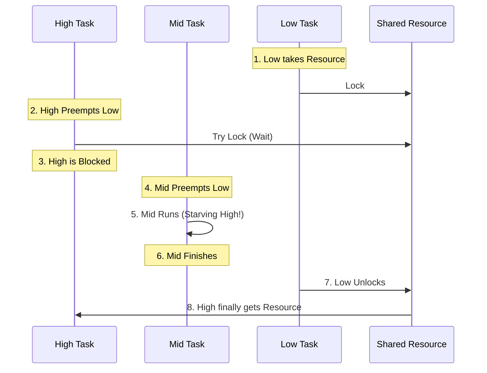

### 8.4 해결책: 우선순위 상속 (Priority Inheritance)
FreeRTOS의 Mutex는 이 문제를 방지하기 위한 알고리즘을 내장하고 있습니다.

*   **상속 동작**: 높은 우선순위 태스크가 자원을 기다리기 시작하면, 자원을 소유한 **낮은 우선순위 태스크의 등급을 일시적으로 최고 수준으로 격상**시킵니다.
*   **효과**: 격상된 Low Task는 Mid Task에 의해 선점되지 않고 빠르게 작업을 마친 뒤 자원을 반납할 수 있습니다. 자원을 반납하는 즉시 원래의 낮은 우선순위로 복구됩니다.

### 8.5 Mutex vs Binary Semaphore
이 둘의 가장 큰 차이점 중 하나가 바로 이 **우선순위 상속 지원 여부**입니다.

| 항목 | Mutex | Binary Semaphore |
| :--- | :--- | :--- |
| **우선순위 상속** | **지원함** (Inversion 방지) | 지원하지 않음 |
| **소유권 (Ownership)** | 있음 (준 태스크만 줄 수 있음) | 없음 (누구나 줄 수 있음) |
| **권장 용도** | 공유 자원 보호 (Critical Section) | 태스크 간 동기화, 신호 전달 |

### 8.6 엔지니어링 권장사항
*   **Mutex 사용**: 공유 데이터를 보호할 때는 반드시 Semaphore가 아닌 Mutex를 사용하십시오.
*   **임계 구역 최소화**: 우선순위 상속이 일어나더라도 시스템 전체의 실시간성은 저하됩니다. 자원을 잡고 있는 시간 자체를 줄이는 것이 최선입니다.
*   **설계 단순화**: 가급적 높은 우선순위 태스크와 낮은 우선순위 태스크가 자원을 공유하지 않도록 설계하는 것이 가장 안전합니다.

### 8.7 이중 시나리오 비교 실험 구조
Binary Semaphore와 Mutex의 실제 동작 차이를 같은 태스크 코드로 확인하려면 핸들 생성부만 교체합니다.

```cpp
// 시나리오 A: Binary Semaphore — 우선순위 상속 없음 → 역전 발생
SemaphoreHandle_t bs = xSemaphoreCreateBinary();
xSemaphoreGive(bs);   // 최초 사용 가능 상태로 준비
run_scenario("Binary Semaphore (inversion visible)", bs);

// 시나리오 B: Mutex — 우선순위 상속 자동 적용 → 역전 해소
run_scenario("Mutex (inversion resolved)", xSemaphoreCreateMutex());
```

### 8.8 타임스탬프로 역전 수치 입증
로그에 밀리초 단위 타임스탬프를 찍으면 역전 현상을 수치로 확인할 수 있습니다.

```cpp
#define NOW_MS()  ((uint32_t)(xTaskGetTickCount() * portTICK_PERIOD_MS))
printf("[t=%4u ms] HIGH acquired (waited %u ms)\n", NOW_MS(), waited_ms);
```

| 시나리오 | HIGH의 대기 시간 |
| :--- | :--- |
| Binary Semaphore | LOW 작업(3 s) + MID 실행(2 s) ≈ **5 s** |
| Mutex | LOW 작업(3 s)만 기다림 ≈ **3 s** (MID 선점 차단) |

---

## 9. IRAM vs Flash Timing (하드웨어 가속과 실행 결정론)

### 9.1 하바드 아키텍처와 메모리 계층 구조
ESP32-C3의 RISC-V 코어는 명령어(Instruction)와 데이터(Data) 버스가 분리된 하바드 아키텍처를 따릅니다. 하지만 물리적인 실행 코드는 외부 **SPI Flash**에 저장되어 있으며, 이를 효율적으로 실행하기 위해 내부 **Instruction Cache (I-Cache)**를 거쳐 CPU로 전달됩니다.

### 9.2 Flash 실행의 비결정론적 특성 (Jitter)
Flash에서 직접 코드를 실행할 때(기본 방식), 성능은 캐시 상태에 의존합니다.

*   **Cache Hit**: CPU 클록과 거의 동일한 속도로 명령어 실행.
*   **Cache Miss**: SPI 버스를 통해 외부 Flash에서 데이터를 가져와야 하므로 수십 사이클 이상의 지연(Latency) 발생.
*   **문제점**: 인터럽트 응답이나 정밀 타이밍이 중요한 통신 프로토콜 실행 시, 캐시 상태에 따라 실행 시간이 들쭉날쭉해지는 **Jitter** 현상이 발생합니다.

### 9.3 IRAM (Internal RAM)의 역할
IRAM은 CPU 내부에 위치한 고속 SRAM입니다. 여기에 배치된 코드는 캐시를 거치지 않고 CPU와 직결되어 실행되므로, **결정론적(Deterministic) 실행 시간**을 보장합니다.

| 특성 | Flash 실행 (VFS/Cache) | IRAM 실행 |
| :--- | :--- | :--- |
| **속도** | 캐시 상태에 따라 가변적 | 항상 최고 속도 (Zero Wait-state) |
| **결정론** | 낮음 (예측 불가한 지연 발생 가능) | **높음 (항상 동일한 사이클 소요)** |
| **용량** | 최대 16MB (외부 Flash) | 약 400KB (SRAM 공유) |
| **전력 소모** | SPI 통신 및 캐시 작동으로 높음 | 내부 로직만 사용하여 낮음 |

### 9.4 IRAM_ATTR와 링커(Linker) 배치
`IRAM_ATTR` 속성을 함수 앞에 붙이면, 컴파일러와 링커는 해당 함수를 `.flash.text` 섹션이 아닌 `.iram1.text` 섹션에 배치합니다.

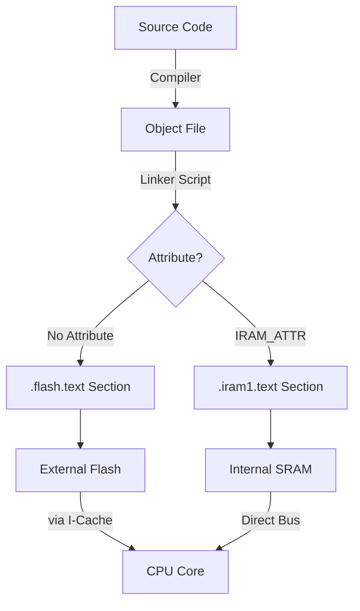

### 9.5 실무 활용 가이드: 무엇을 IRAM에 넣어야 하는가?
SRAM 용량은 제한적이므로 모든 코드를 IRAM에 넣을 수는 없습니다. 다음과 같은 경우에만 선별적으로 사용합니다.

1.  **ISR (인터럽트 서비스 루틴)**: 하드웨어 이벤트에 대해 즉각적이고 일정한 응답 속도가 필요한 경우.
2.  **Critical Timing Code**: Bit-banging 통신(예: WS2812 LED 제어)이나 정밀 PWM 제어.
3.  **Flash Write 중 실행 코드**: SPI Flash에 데이터를 쓰는 동안에는 Flash에서 코드를 읽어올 수 없습니다. 이 때 실행되어야 하는 코드는 반드시 IRAM에 있어야 시스템이 Crash되지 않습니다.

### 9.6 성능 측정 팁
`mcycle` 레지스터를 사용하여 두 방식의 차이를 정밀 분석할 수 있습니다.
*   **Flash**: 첫 번째 호출(Cache Miss)과 두 번째 호출(Cache Hit)의 사이클 차이가 큼.
*   **IRAM**: 매 호출마다 거의 동일한 사이클 소요.

### 9.7 통계 기반 비교와 캐시 워밍업
단일 측정값은 신뢰할 수 없습니다. 여러 샘플(예: 30회)을 수집하여 최솟값/최댓값/평균과 분포를 확인해야 합니다.

```cpp
// 워밍업: 캐시에 코드를 미리 로드한 뒤 본 측정 시작
fn(); fn();

Stats s = { .min = UINT32_MAX };
for (int i = 0; i < SAMPLES; i++) {
    uint32_t t0 = read_mcycle();
    volatile uint32_t r = fn();
    uint32_t cy = read_mcycle() - t0;
    if (cy < s.min) s.min = cy;
    if (cy > s.max) s.max = cy;
    s.sum += cy;
}
s.avg = s.sum / SAMPLES;
printf("min=%u  max=%u  avg=%u  spread=%u\n", s.min, s.max, s.avg, s.max - s.min);
```

**워밍업의 이유**: Flash 함수는 첫 호출 시 I-Cache 미스가 발생합니다. 워밍업을 생략하면 첫 번째 샘플이 수배 크게 나타나 평균을 왜곡합니다. 반대로 의도적으로 워밍업을 제거하여 "Cold Cache" 효과를 측정할 수도 있습니다.

### 9.8 히스토그램으로 분포 해석
평균(avg)보다 **분포 형태**가 더 중요합니다.

```
[Flash]  min=420  max=1840  avg=510 cycles  spread=1420 (두 개의 클러스터)
[IRAM ]  min=418  max=432   avg=421 cycles  spread=14   (단일 좁은 피크)
```

*   Flash 히스토그램이 두 개의 피크를 보이면: 하나는 Cache Hit(빠름), 하나는 Cache Miss(느림)가 측정되고 있는 것입니다.
*   `spread = max - min`이 IRAM에서 현저히 작다면 캐시 제거(IRAM_ATTR)가 결정론성을 회복시키고 있다는 증거입니다.

---

## 10. ISR Latency (인터럽트 지연 시간과 실시간 응답성)

### 10.1 인터럽트 지연의 하드웨어적 정의
인터럽트 지연(Latency)은 외부 핀 신호 변화나 타이머 만료와 같은 하드웨어 이벤트가 발생한 순간부터, CPU가 해당 인터럽트를 처리하는 첫 번째 명령어(ISR의 Entry Point)를 실행하기까지 소요되는 시간을 의미합니다. 이는 시스템의 **실시간성(Real-time Responsiveness)**을 결정짓는 가장 중요한 지표입니다.

### 10.2 인터럽트 처리의 5단계 과정
이 지연 시간은 단순히 "점프"하는 시간이 아니라, 하드웨어와 소프트웨어가 협력하는 복잡한 단계를 거칩니다.

1.  **Signal Detection**: 하드웨어 핀에서 신호 변화를 감지 (약 1~2 사이클).
2.  **Interrupt Controller (PLIC)**: 신호가 인터럽트 컨트롤러로 전달되어 현재 실행 중인 코드보다 우선순위가 높은지 판단.
3.  **Pipeline Flush**: 현재 실행 중인 명령어를 강제로 중단하고 파이프라인을 비움.
4.  **Context Save**: 현재 CPU의 레지스터들(a0~a7, t0~t6 등)의 상태를 현재 태스크의 스택에 백업. (가장 많은 시간 소요)
5.  **Vector Jump**: 인터럽트 벡터 테이블을 참조하여 지정된 ISR 함수 주소로 점프.

### 10.3 지연 시간 시각화 (Detailed)
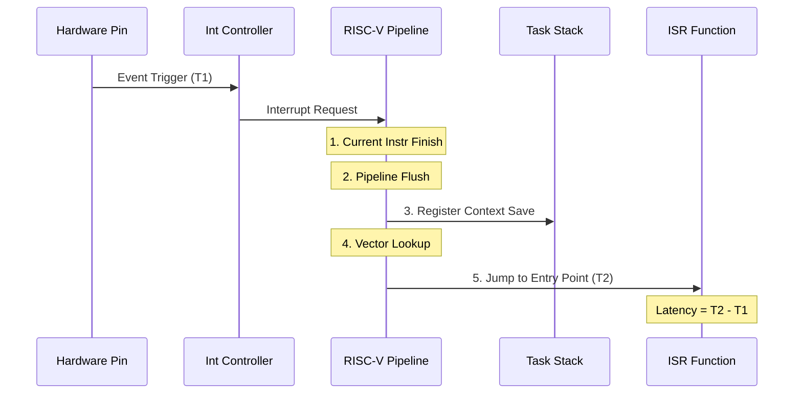

### 10.4 지연 시간을 증가시키는 요인 (Jitter)
모든 인터럽트 지연 시간이 항상 동일하지는 않으며, 다음과 같은 이유로 변동성(Jitter)이 발생합니다.

*   **Critical Sections**: 코드의 다른 부분에서 `portENTER_CRITICAL()` 등을 통해 인터럽트를 비활성화한 경우, 해당 구간이 끝날 때까지 인터럽트 처리가 지연됩니다.
*   **Instruction Cache Miss**: ISR 코드가 Flash에 있고 캐시에 로드되어 있지 않다면, 외부 Flash에서 코드를 가져오는 시간만큼 추가 지연이 발생합니다. (9번 섹션 참고)
*   **Nested Interrupts**: 더 높은 우선순위의 다른 인터럽트가 이미 실행 중인 경우, 해당 ISR이 종료될 때까지 대기해야 합니다.

### 10.5 지연 시간 최소화 체크리스트
극한의 실시간 응답성이 필요한 경우 다음을 준수해야 합니다.

1.  **IRAM_ATTR 사용**: ISR 함수를 IRAM에 배치하여 캐시 미스를 원천 차단합니다.
2.  **최소한의 컨텍스트 저장**: 가능하다면 레지스터 사용을 최소화하여 백업/복구 오버헤드를 줄입니다.
3.  **No Blocking in ISR**: ISR 내에서는 절대 `delay()`나 Mutex 대기 등 Block을 유발하는 코드를 넣지 않습니다.
4.  **우선순위 최적화**: 가장 응답이 빨라야 하는 하드웨어 인터럽트에 가장 높은 우선순위(Priority Level)를 부여합니다.

### 10.6 측정 팁: 소프트웨어 트리거
실제 보드에서는 외부 신호를 정확한 시점에 주기가 어렵습니다. 예제 코드처럼 특정 핀을 출력으로 설정하고 소프트웨어로 `digitalWrite()`를 수행한 직후 사이클을 측정하면, 하드웨어적 지연 시간을 매우 정밀하게 시뮬레이션할 수 있습니다.

### 10.7 소프트웨어 루프백 측정 설정
별도 오실로스코프 없이 두 GPIO를 점퍼 선으로 연결하면 ISR 지연을 직접 측정할 수 있습니다.

```
GPIO3(출력, 트리거) ──────── GPIO2(입력, ISR 발생)
         └──── 점퍼 선 연결 ────┘
```

측정 흐름:
1. `mcycle` 저장 → `gpio_set_level(TRIGGER_PIN, 0)` (하강 엣지 생성)
2. GPIO2에서 하강 엣지 감지 → ISR 진입 → 첫 줄에서 `mcycle` 저장
3. `latency = isr_cycle − trigger_cycle`

```cpp
static void IRAM_ATTR gpio_isr_handler(void *arg) {
    uint32_t t;
    __asm__ __volatile__("csrr %0, mcycle" : "=r"(t) :: "memory");
    g_isr_cycle    = t;
    g_sample_ready = true;
    gpio_set_level(TRIGGER_PIN, 1);  // 다음 측정을 위해 재무장
}

// ISR 서비스 설치 시 ESP_INTR_FLAG_IRAM 플래그 필수
gpio_install_isr_service(ESP_INTR_FLAG_IRAM);
```

### 10.8 통계 수집과 지터 해석
50샘플 수집 결과 예시:

```
[ISR Latency — 50 samples at 160 MHz]
  min  =  89 cycles  =  556 ns
  max  = 142 cycles  =  888 ns
  avg  =  97 cycles  =  606 ns
  jitter (max − min) = 53 cycles = 331 ns
```

*   **min**: 파이프라인이 최적 상태일 때의 이상적인 지연. I-Cache 히트 + 인터럽트 미차단 조건.
*   **max**: 앞선 Critical Section 또는 I-Cache 미스에 의한 추가 지연.
*   **jitter = max − min**: 시스템이 보장할 수 있는 최악 응답 시간(WCRT)을 결정합니다. `IRAM_ATTR` 적용 시 10~20 사이클 수준으로 줄어듭니다.

---

## 11. Software Logic Analyzer (종합 프로젝트: 실시간 데이터 획득 시스템)

### 11.1 프로젝트 개요
본 프로젝트는 ESP32-C3의 고속 RISC-V 코어와 FreeRTOS의 우선순위 스케줄링을 결합하여, 외부 디지털 신호를 정밀하게 캡처하고 분석하는 **소프트웨어 기반 로직 분석기**를 구현합니다. 이는 "고속 데이터 생성(Producer)"과 "저속 데이터 처리(Consumer)"가 공존하는 전형적인 실시간 시스템의 축소판입니다.

### 11.2 이중 태스크 아키텍처 (Dual-Task Architecture)
시스템의 응답성을 보장하기 위해 역할을 엄격히 분리합니다.

| 태스크 | 이름 | 우선순위 | 역할 및 특징 |
| :--- | :--- | :--- | :--- |
| **High-Prio** | **Sampler** | 10 (Max) | 최단 주기로 GPIO를 샘플링하여 버퍼에 저장. IRAM에서 실행 권장. |
| **Low-Prio** | **Analyzer** | 1 (Min) | 버퍼가 가득 차면 데이터를 시리얼로 전송하거나 통계 계산. |

### 11.3 데이터 흐름 시각화
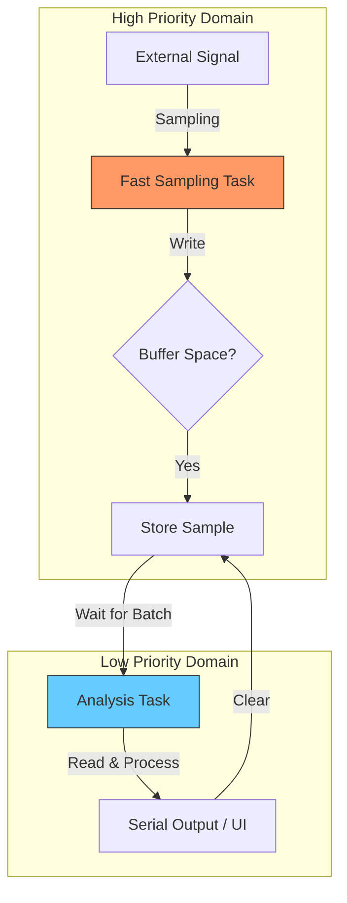

### 11.4 버퍼 관리 전략: Ring Buffer vs Ping-Pong Buffer
고속 데이터 전송 시 데이터 유실을 막기 위한 두 가지 전략입니다.

1.  **Ring Buffer (현재 예제 적용)**: 하나의 큰 원형 버퍼를 사용합니다. 쓰기 인덱스(Head)가 끝에 도달하면 다시 처음으로 돌아갑니다. 구현이 간단하지만, 분석 속도가 느리면 데이터가 덮어씌워질(Overwrite) 위험이 있습니다.
2.  **Ping-Pong Buffer (심화)**: 두 개의 버퍼(A, B)를 준비합니다. Sampler가 A에 쓰는 동안 Analyzer는 B를 처리합니다. A가 꽉 차면 역할을 교체합니다. 데이터 처리의 연속성을 보장하는 가장 확실한 방법입니다.

### 11.5 샘플링 주률과 CPU 부하의 트레이드오프
샘플링 빈도가 높을수록 신호의 정밀도는 올라가지만, 시스템 전체의 부하가 커집니다.

*   **Nyquist 이론**: 측정하고자 하는 신호 주파수의 최소 2배 이상으로 샘플링해야 신호 복원이 가능합니다.
*   **CPU 점유**: `delayMicroseconds(10)`을 사용한 100kHz 샘플링은 싱글 코어 CPU의 상당 부분을 점유합니다. 이 경우 Analyzer 태스크는 Sampler가 쉴 때만(버퍼가 찰 때까지 기다리는 등) 실행될 수 있습니다.

### 11.6 실무 최적화 기술
*   **Direct Register Access**: `digitalRead()`는 편리하지만 함수 호출 오버헤드가 있습니다. 더 높은 속도가 필요하다면 `GPIO.in` 레지스터를 직접 읽어 처리 시간을 단축할 수 있습니다.
*   **DMA 활용 (심화)**: ESP32-C3의 SPI나 I2S 컨트롤러를 "Parallel Mode"로 설정하면, CPU 개입 없이 하드웨어가 직접 GPIO 상태를 메모리로 쏟아붓게 할 수 있습니다. (최대 수십 MHz 샘플링 가능)
*   **Timestamping**: 단순 상태뿐만 아니라, `mcycle` 값을 함께 기록하면 신호의 지속 시간(Duration)을 나노초 단위로 분석할 수 있습니다.

### 11.7 학습 요약
이 프로젝트를 통해 다음을 마스터할 수 있습니다:
1.  태스크 간 우선순위 설계의 중요성.
2.  공유 버퍼를 통한 대량 데이터의 안전한 전달.
3.  하드웨어 한계치까지 시스템 성능을 끌어올리는 최적화 기법.

### 11.8 직접 GPIO 레지스터 접근
`gpio_get_level()` 함수는 인수 검사와 함수 호출 오버헤드가 있어 고속 샘플링에 불리합니다. `REG_READ(GPIO_IN_REG)`로 GPIO 0~31의 상태를 **한 번의 레지스터 읽기**로 얻을 수 있습니다.

```cpp
#include "soc/gpio_reg.h"

uint32_t reg = REG_READ(GPIO_IN_REG);   // GPIO 0~31 비트맵
uint8_t  lvl = (reg >> SAMPLE_PIN) & 0x1;
```

이 방법은 `gpio_get_level()` 대비 약 3~5배 빠르며, 여러 핀을 동시에 읽어야 할 때(병렬 버스 분석) 특히 유용합니다. Sampler 태스크에 `IRAM_ATTR`을 추가하면 이 읽기 루틴 자체도 캐시 미스 없이 실행됩니다.

### 11.9 엣지 감지와 주파수 추정 알고리즘
연속된 샘플에서 레벨 변화를 감지하면 엣지 타임스탬프를 mcycle 단위로 기록할 수 있습니다.

```
샘플 스트림: 1 1 1 0 0 0 1 1 1 0 ...
                   ↑             ↑
                하강 엣지     상승 엣지
                (HIGH 구간)   (LOW 구간)
```

```cpp
if (s->level != prev_level) {
    uint32_t duration_cy = s->timestamp - prev_ts;
    double   duration_us = (double)duration_cy * 1e6 / CPU_FREQ_HZ;

    if (prev_level == 1) high_sum += duration_cy;   // HIGH 구간 누적
    else                  low_sum  += duration_cy;   // LOW  구간 누적
}
// 주파수 추정
double period_us = avg_high_us + avg_low_us;
double freq_hz   = (period_us > 0) ? 1e6 / period_us : 0;
```

mcycle 타임스탬프를 사용하면 실제 샘플링 주기보다 훨씬 높은 해상도로 엣지 타이밍을 측정할 수 있습니다. (6.25 ns 분해능 @ 160 MHz)

### 11.10 내장 테스트 신호 생성기
외부 신호 소스 없이 분석기를 자기 자신으로 검증하려면 GPIO3을 500 Hz 구형파 출력으로 설정하고 GPIO2와 점퍼 선으로 연결합니다.

```
GPIO3(출력 — 500 Hz 구형파) ─── [점퍼] ─── GPIO2(입력 — 샘플링)
```

```cpp
void signal_gen_task(void *arg) {
    gpio_set_direction(GPIO_NUM_3, GPIO_MODE_OUTPUT);
    uint32_t lvl = 0;
    while (1) {
        gpio_set_level(GPIO_NUM_3, lvl ^= 1);
        vTaskDelay(pdMS_TO_TICKS(1));   // 1 ms 주기 → 500 Hz 구형파
    }
}
```

예상 출력:
```
[Edge  1] LO→HI  duration=1.00 ms
[Edge  2] HI→LO  duration=1.00 ms
=== Signal Analysis (20 edges) ===
  avg HIGH : 1.00 ms
  avg LOW  : 1.00 ms
  est freq : 500.0 Hz
```

---

## 12. I-Cache Cold Miss vs Warm Cache (캐시 미스 페널티 정밀 측정)

### 12.1 실습 개요
동일한 알고리즘을 IRAM과 Flash 두 곳에 배치하고, 캐시 상태에 따른 실행 시간 차이를 사이클 단위로 측정합니다. "첫 번째 호출 = Cold Miss", "반복 호출 = Warm Cache"라는 I-Cache의 핵심 동작을 수치로 확인합니다.

### 12.2 I-Cache 구조 (ESP32-C3)

| 항목 | 값 |
| :--- | :--- |
| **용량** | 16 KB |
| **구조** | 4-way set-associative |
| **라인 크기** | 32 bytes (8 words) |
| **대상** | Flash의 코드(.text) + 읽기 전용 데이터(.rodata) |
| **채우기 정책** | Cache Miss 시 SPI Flash에서 32 bytes 통째로 로드 |

### 12.3 SPI 버스 속도와 미스 페널티

```
Cache MISS 발생 → SPI XIP Bridge → Flash에서 32 bytes 패치
  SPI 클록: 80 MHz → 12.5 ns/byte
  32 bytes × 12.5 ns = 400 ns = 64 cycles @ 160 MHz
  (실측: 파이프라인 + 제어 오버헤드 포함 약 20~40 cycles)
```

### 12.4 캐시 용량 초과 (Thrashing)
함수 코드 크기가 I-Cache 용량(16 KB)을 초과하면, 워밍 후에도 일부 캐시 라인이 지속적으로 교체(Eviction)되어 "항상 미스" 상태가 됩니다.

```
소형 함수 (< 16KB):  Cold ≫ Warm ≈ IRAM   (라인이 캐시에 안착)
대형 함수 (> 16KB):  Cold ≈ Warm ≫ IRAM   (캐시가 항상 꽉 참)
```

### 12.5 측정 결과 해석 예시

```
[A] Small workload (256 bytes input)
  Cold Miss (1st call) = 1840 cycles  (11500 ns)
  Flash warm  min=418  avg=421.3  max=432  spread=14
  IRAM        min=416  avg=417.1  max=419  spread=3
  Cold Miss penalty = +1419 cycles  (8869 ns)
  추정 SPI 속도 = 13.8 ns/byte  (예상: ~12.5 ns @80 MHz)
```

### 12.6 결론: IRAM_ATTR 사용 기준
*   **ISR**: 하드웨어 이벤트 응답이 첫 번째 호출에도 일정해야 함 → 필수
*   **타이밍 임계 루틴**: Bit-banging, 정밀 PWM → 필수
*   **Flash 쓰기 중 실행 코드**: XIP 정지 구간에서도 동작해야 함 → 필수
*   **일반 로직**: 반복 호출로 Warm 상태 유지 가능 → 불필요

---

## 13. Data Locality & Cache Line Efficiency (데이터 지역성과 캐시 라인 효율)

### 13.1 실습 개요
Flash rodata에 배치된 대형 배열에 다양한 접근 패턴(순차·스트라이드·무작위)을 적용하여, 캐시 라인 크기(32 bytes)가 성능에 미치는 영향을 정량적으로 분석합니다.

### 13.2 캐시 라인(Cache Line)의 원리

```
Cache Miss 1회 → Flash에서 32 bytes 한 번에 로드 (Line Fill)

stride=1  (1 byte씩):  미스 1회당 32 bytes 사용 → 효율 32×
stride=32 (1라인씩):  미스 1회당  1 byte 사용 → 효율  1×
stride=64 (2라인씩):  매 접근마다 미스, 짝수 라인만 사용 → 낭비
```

### 13.3 스트라이드별 성능 특성

| 스트라이드 | 미스율 | 효율 | 비고 |
| :--- | :--- | :--- | :--- |
| 1 byte | 1/32 | 최고 | 순차 접근 — 이상적 |
| 4 bytes | 1/8 | 높음 | word 정렬 접근 |
| 32 bytes | 1/1 | 최저(이론) | 라인당 1 byte 사용 |
| 64 bytes | 1/1 | 최저 | 짝수 캐시 라인만 사용 |
| 무작위 | ~1/1 | 최저 | set conflict 가능 |

### 13.4 캐시 스래싱(Cache Thrashing)
4-way set-associative 캐시에서 스트라이드가 캐시 용량(16 KB)의 약수이면, 접근이 같은 캐시 Set에 집중됩니다. 4-way이므로 4개 초과 시 기존 라인이 강제 교체됩니다.

```
배열 크기 > 16 KB + stride = 캐시 라인 배수 → Thrashing 발생
cy/access가 random보다도 높게 측정되는 경우 Thrashing 중
```

### 13.5 실용 지침
*   **Flash rodata 배열은 순차적으로 초기화**: 룩업 테이블을 건너뛰며 읽지 말 것
*   **핫 테이블은 IRAM에 복사**: `memcpy(iram_buf, flash_table, size)` 후 IRAM 포인터 사용
*   **구조체 패킹**: 자주 함께 읽히는 필드를 연속 배치하여 한 라인에 담기

---

## 14. Cache Coherency (캐시 일관성 문제와 해결)

### 14.1 실습 개요
Flash 내용을 변경한 후 캐시가 갱신되지 않아 CPU가 오래된 데이터(Stale Data)를 읽는 현상을 재현하고, `esp_cache_msync()`로 캐시를 무효화하여 해결하는 과정을 실습합니다.

### 14.2 Stale Data 발생 메커니즘

```
1. CPU reads Flash[X] → 캐시 라인에 값 A 로드됨
2. spi_flash_write(X, B) → Flash 물리 주소에는 B가 기록됨
3. CPU reads Flash[X] again → 캐시 라인이 A를 반환 (Stale!)
4. esp_cache_msync(ptr, size, INVALIDATE) 호출
5. CPU reads Flash[X] again → Flash에서 B를 재로드 (Fresh!)
```

### 14.3 캐시 무효화 API

```cpp
/* ESP-IDF v5.2+ 공식 API */
#include "esp_cache.h"

esp_cache_msync(
    ptr,                              /* 무효화할 가상 주소 */
    size,                             /* 범위 (bytes) */
    ESP_CACHE_MSYNC_FLAG_INVALIDATE   /* 캐시 라인 무효화 */
    | ESP_CACHE_MSYNC_FLAG_TYPE_DATA  /* 데이터 캐시 대상 */
    | ESP_CACHE_MSYNC_FLAG_TYPE_INST  /* 명령어 캐시도 포함 */
);
```

### 14.4 주의사항
*   ESP-IDF v5.0 이후, `esp_partition_write()`는 일부 자동 무효화를 수행할 수 있습니다
*   `spi_flash_write()` 직접 호출 시에는 수동 무효화가 항상 필요합니다
*   OTA 업데이트 후 `esp_restart()` 이전에 `esp_cache_msync()` 호출 권장
*   캐시 무효화 없이 mmap 포인터로 Flash를 읽으면 항상 일관성 문제 가능성 존재

---

## 15. Flash MMU (가상↔물리 주소 매핑 분석)

### 15.1 실습 개요
`esp_partition_mmap()`으로 파티션을 CPU 가상 주소에 매핑하고, MMU 테이블 레지스터를 직접 읽어 가상 주소 → 물리 Flash 오프셋 변환 과정을 분석합니다.

### 15.2 ESP32-C3 메모리 맵

| 가상 주소 범위 | 대상 | 경로 |
| :--- | :--- | :--- |
| `0x42000000~0x44000000` | Flash 코드(IBUS) | I-Cache → SPI |
| `0x3C000000~0x3E000000` | Flash 데이터(DBUS) | D-Cache → SPI |
| `0x3FC80000~0x3FCFFFFF` | Internal SRAM | 직결 (캐시 없음) |

### 15.3 MMU 테이블 구조

```
MMU Table @ 0x600C4800 (128 entries × 4 bytes)

Entry [i]:
  bit[8]   = Valid (1=매핑됨)
  bit[7:0] = Flash Page Number

가상 주소 계산:
  virt_addr = base + page_index × 64KB

물리 오프셋 계산:
  phys_offset = flash_page_number × 64KB + page_内_offset
```

### 15.4 주소 변환 공식

```cpp
uint32_t page_idx  = (vaddr - 0x42000000) / (64 * 1024);
uint32_t entry     = MMU_TABLE[page_idx];
uint32_t phys_page = entry & 0xFF;
uint32_t flash_off = phys_page * 64 * 1024 + (vaddr % (64 * 1024));
```

### 15.5 OTA에서의 MMU 역할
OTA는 새 파티션에 이미지를 기록 후 재부팅 시 부트로더가 MMU 테이블의 Flash 페이지 번호만 교체합니다. 앱 코드가 참조하는 가상 주소는 변하지 않으므로, CPU 관점에서는 같은 주소에서 코드가 실행됩니다.

---

## 16. PMP Sandbox (RISC-V 물리 메모리 보호)

### 16.1 실습 개요
RISC-V M-mode CSR인 `pmpcfg`/`pmpaddr`을 직접 설정하여 특정 SRAM 영역을 읽기 전용으로 보호하고, 위반 시 발생하는 예외 코드(mcause, mtval)를 분석합니다.

### 16.2 PMP 레지스터 구조

```
pmpcfg0  = [cfg3][cfg2][cfg1][cfg0]   (각 8비트)
pmpcfg1  = [cfg7][cfg6][cfg5][cfg4]

각 cfg 바이트:
  Bit 7 : L  — Lock (리셋 전까지 변경 불가)
  Bit 4~3: A  — 주소 매칭 모드
              00=OFF  01=TOR  10=NA4  11=NAPOT
  Bit 2 : X  — Execute 허용
  Bit 1 : W  — Write 허용
  Bit 0 : R  — Read 허용
```

### 16.3 NAPOT 주소 인코딩

```cpp
/* 256 bytes @ base (256-byte 정렬 필수) */
uint32_t pmpaddr = (base | (256 / 2 - 1)) >> 2;
//               = (base | 0x7F) >> 2

/* cfg = R=1, W=0, X=0, A=NAPOT */
uint8_t cfg = PMP_R | PMP_A_NAPOT;   /* = 0x1B */
```

### 16.4 위반 시 예외 정보

| mcause 값 | 예외 종류 | 원인 |
| :--- | :--- | :--- |
| 1 | Instruction access fault | PMP X=0 인 영역 실행 시도 |
| 5 | Load access fault | PMP R=0 인 영역 읽기 시도 |
| 7 | Store/AMO access fault | PMP W=0 인 영역 쓰기 시도 |

`mtval` = 위반이 발생한 **물리 주소**  
`mepc`  = 위반을 일으킨 **명령어의 가상 주소**

### 16.5 ESP-IDF 기본 PMP 사용 현황
부팅 시 ESP-IDF는 PMP 항목 0~5를 시스템 보호용으로 사전 설정합니다. 사용자 코드는 **항목 6~15**를 사용해야 충돌을 피할 수 있습니다.

### 16.6 실무 활용
*   **NULL 포인터 감지**: 0x0~0xFFF를 NO_ACCESS(`A=TOR, R=W=X=0`)로 설정
*   **커널 영역 보호**: IRAM 코드 영역을 사용자 태스크에서 쓰기 불가로 설정
*   **스택 오버플로우 감지**: 각 태스크 스택 하단에 Guard Page (4B NA4) 설정

---

## 17. OTA MMU Remapping (하드웨어 Bank Switching 추적)

### 17.1 실습 개요
OTA 업데이트의 본질은 "새 Flash 파티션에 이미지를 쓰고, 재부팅 시 부트로더가 MMU를 교체"하는 것임을 코드로 직접 확인합니다. `esp_ota_get_running_partition()`과 MMU 테이블 역산을 통해 가상 주소가 부팅마다 다른 물리 파티션을 가리킨다는 것을 수치로 검증합니다.

### 17.2 OTA 동작 흐름

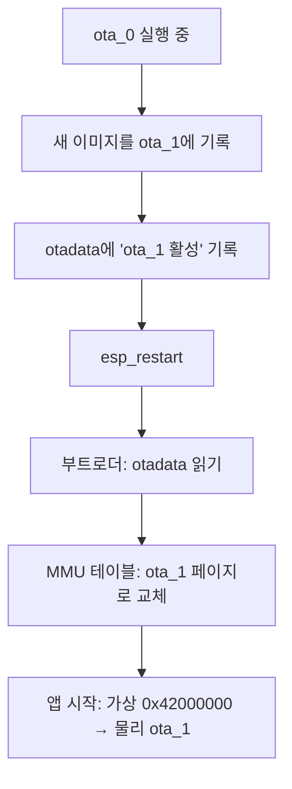

### 17.3 파티션 오프셋과 가상 주소 관계

```
부팅 0 (ota_0):
  app_main 가상  = 0x42003C20
  app_main 물리  = 0x00013C20  (ota_0 시작: 0x10000)

부팅 1 (ota_1):
  app_main 가상  = 0x42003C20  ← 동일!
  app_main 물리  = 0x001B3C20  (ota_1 시작: 0x1B0000)
```

가상 주소는 고정, 물리 주소만 달라집니다. 이것이 **하드웨어 Bank Switching**입니다.

### 17.4 RTC 메모리로 리부팅 간 상태 보존

```cpp
/* RTC RAM: 일반 SRAM은 리셋 시 초기화되지만 RTC RAM은 유지됨 */
RTC_DATA_ATTR static uint32_t g_prev_flash_offset = 0;
RTC_DATA_ATTR static char     g_prev_label[16]    = {0};

/* 재부팅 후 이전 부팅의 파티션 오프셋과 비교 */
if (running->address != g_prev_flash_offset) {
    printf("MMU 리매핑 확인! 이전=0x%X 현재=0x%X\n",
           g_prev_flash_offset, running->address);
}
```

### 17.5 OTA 실습 전제조건
*   `menuconfig → Partition Table → "Factory app, two OTA definitions"` 선택
*   두 OTA 파티션(`ota_0`, `ota_1`)에 모두 유효한 앱 이미지 필요
*   `esp_ota_set_boot_partition()`은 이미지가 없는 파티션을 활성화할 수 없음

---

## 18. Boot Diagnosis — Cold / Warm / Sync Abnormal / Async Abnormal

### 18.1 네 가지 부팅 유형

| 유형 | 전원 | SRAM | RTC RAM | reset_reason | 재현성 |
| :--- | :--- | :--- | :--- | :--- | :--- |
| **Cold Boot** | 새로 공급 | 초기화 | 초기화 | `ESP_RST_POWERON` | 항상 같음 |
| **Warm Boot** | 유지 | 초기화 | **보존** | `ESP_RST_SW` / `DEEPSLEEP` | 의도적 |
| **Sync Abnormal** | 유지 | 초기화 | 보존 | `ESP_RST_PANIC` | **재현 가능** |
| **Async Abnormal** | 유지 | 초기화 | 보존 | `ESP_RST_TASK_WDT` / `BROWNOUT` | **재현 불가** |

### 18.2 Sync vs Async Abnormal 핵심 차이

```
Sync Abnormal (동기 예외)
  ┌────────────────────────────────────────────────────┐
  │ 특정 명령어 실행 → 예외 발생                        │
  │ mcause[31] = 0  (동기 예외)                        │
  │ mepc        = 원인 명령어의 가상 주소  ← 유의미     │
  │ mtval       = 위반 접근 주소                        │
  │ 예: NULL 역참조, Illegal Instruction, PMP 위반     │
  └────────────────────────────────────────────────────┘

Async Abnormal (비동기 인터럽트성 리셋)
  ┌────────────────────────────────────────────────────┐
  │ 외부 이벤트 (WDT 타임아웃, 전압 저하)               │
  │ 어떤 명령어를 실행하던 중이었든 무관               │
  │ mepc        = 리셋 시점 우연한 위치  ← 무의미       │
  │ 디버깅 접근: 로그/WDT 피드 위치 추적               │
  └────────────────────────────────────────────────────┘
```

### 18.3 RISC-V mcause 코드

| mcause 값 | 예외 종류 | 진단 힌트 |
| :--- | :--- | :--- |
| 0 | Instruction address misaligned | 홀수 주소로 점프 |
| 1 | Instruction access fault | 실행 불가 영역 진입 (PMP X=0) |
| 2 | Illegal instruction | 미지원 명령어 / 잘못된 opcode |
| 4 | Load address misaligned | 정렬되지 않은 주소 읽기 |
| 5 | Load access fault | 읽기 불가 영역 (PMP R=0) |
| 6 | Store/AMO address misaligned | 정렬되지 않은 주소 쓰기 |
| 7 | Store/AMO access fault | **NULL 쓰기**, PMP W=0 위반 |

### 18.4 RTC RAM으로 예외 정보 보존

Sync Abnormal 발생 시 패닉 핸들러가 실행되기 전에 SRAM 내용은 유지되지만, 일반 리셋 후에는 SRAM이 초기화됩니다. `RTC_DATA_ATTR`로 선언된 변수는 Warm Boot 계열 리셋에서도 보존됩니다.

```cpp
/* Sync 예외 직전 RTC RAM에 예외 정보 저장 */
RTC_DATA_ATTR static uint32_t g_last_mcause = 0;
RTC_DATA_ATTR static uint32_t g_last_mtval  = 0;
RTC_DATA_ATTR static uint32_t g_last_mepc   = 0;

/* 다음 부팅에서 읽어 출력 */
if (esp_reset_reason() == ESP_RST_PANIC && g_last_mcause != 0) {
    printf("mcause=0x%08X (%s)\n", g_last_mcause, mcause_str(g_last_mcause));
    printf("mepc  =0x%08X  mtval=0x%08X\n", g_last_mepc, g_last_mtval);
}
```

### 18.5 시나리오 자동 진행 순서

```
부팅 1 (최초/Cold):  진단 출력 → esp_restart()          → Warm Boot 유발
부팅 2 (Warm):      진단 출력 → NULL 포인터 쓰기         → Sync Abnormal 유발
부팅 3 (Panic):     진단 출력 (mcause=7, mtval=0x0)    → TWDT 타임아웃   → Async Abnormal 유발
부팅 4 (TASK_WDT):  진단 출력                           → 종료
```

### 18.6 예상 시리얼 출력 예시

```
# 부팅 3 (Sync Abnormal 이후):
  reset_reason  : PANIC     (Sync Abnormal — 예외)
  부팅 유형     : Sync Abnormal Boot

  ┌─ 이전 부팅 예외 정보 (RTC RAM 저장값) ─────────┐
  │ mcause : 0x00000007  [Store/AMO access fault (PMP W=0 위반 / NULL 쓰기)]
  │ mepc   : 0x42003E80  (원인 명령어 가상 주소)
  │ mtval  : 0x00000000  (위반 접근 주소)
  └────────────────────────────────────────────────┘

# 부팅 4 (Async Abnormal 이후):
  reset_reason  : TASK_WDT  (Async Abnormal — 태스크 WDT)
  부팅 유형     : Async Abnormal Boot
  • 외부 이벤트(WDT 타임아웃, 전압 저하)로 인한 리셋
  • mepc 값이 있어도 '원인 명령어'가 아님 (단순 현재 위치)
```

### 18.7 실무 디버깅 전략

| 부팅 유형 | 디버깅 접근 |
| :--- | :--- |
| Cold Boot | 파워 시퀀스, 브라운아웃 전압 확인 |
| Warm Boot | 의도적 리셋인지 로그로 확인 |
| Sync Abnormal | `mepc` + `mtval` 로 정확한 원인 코드/주소 특정 |
| Async Abnormal | WDT 피드 위치 추적, 로그 타임스탬프 분석, 전압 모니터링 |

---

## 19. Heap Fragmentation — 힙 단편화 분석과 방지

### 19.1 단편화란

총 여유 메모리는 충분하지만 연속된 대형 블록을 할당할 수 없는 상태입니다.

```
단편화 전:  [FFFF][FFFF][FFFF][FFFF]  ← 연속 16 KB, 8 KB 할당 가능
소블록 할당: [AAAA][BBBB][CCCC][DDDD]
A/C 해제:   [FREE][BBBB][FREE][DDDD]  ← 총 여유 8 KB, 하지만 연속 4 KB뿐
8 KB 요청:  실패! (각 FREE 블록이 4 KB로 분리)
```

### 19.2 핵심 API

| 함수 | 반환값 | 용도 |
| :--- | :--- | :--- |
| `heap_caps_get_free_size()` | 총 여유 바이트 | 단편화 전 참고용 |
| `heap_caps_get_largest_free_block()` | 최대 연속 블록 | **실제 할당 가능 한계** |
| `heap_caps_get_minimum_free_size()` | 역대 최소 여유 | 고수위 표시 |
| `heap_caps_dump()` | (출력) | 힙 맵 상세 덤프 |

### 19.3 ESP32-C3 힙 영역

```
DRAM  (MALLOC_CAP_8BIT | MALLOC_CAP_INTERNAL) : ~320 KB
IRAM  (MALLOC_CAP_IRAM_8BIT)                  : ~128 KB (코드 미사용 영역)
DMA   (MALLOC_CAP_DMA)                        : DRAM 내 DMA 가능 영역
```

세 영역은 완전히 독립된 힙입니다. DRAM 단편화가 IRAM 가용량에 영향을 주지 않습니다.

### 19.4 단편화 지수

```cpp
float frag = 1.0f - (float)largest_free / total_free;
// frag = 0%  : 연속 블록이 전체 여유와 같음 (이상적)
// frag = 90% : 여유 메모리의 90%가 분산되어 있음 (위험)
```

### 19.5 메모리 풀 패턴

단편화 방지의 정석: 시작 시 큰 블록 하나를 미리 확보하고 내부 슬롯을 재활용합니다.

```cpp
typedef struct {
    uint8_t  data[SLOT_SZ * SLOT_N];
    uint32_t used;   /* 비트맵 */
} Pool_t;

void *pool_alloc(Pool_t *p) {
    for (int i = 0; i < SLOT_N; i++) {
        if (!(p->used & (1u << i))) {
            p->used |= (1u << i);
            return p->data + i * SLOT_SZ;
        }
    }
    return NULL;  /* 풀 가득 참 */
}
```

힙 레벨 alloc/free가 없으므로 아무리 반복해도 힙 단편화가 발생하지 않습니다.

---

## 20. DMA Cache — DMA 동작과 캐시 일관성

### 20.1 DMA와 캐시의 충돌

DMA는 CPU를 우회하여 직접 SRAM에 접근합니다.

```
TX 방향 (CPU → DMA → 주변장치):
  CPU가 버퍼에 쓴다  → CPU D-Cache에 dirty 기록
  DMA가 SRAM을 읽음  → 캐시에서 SRAM으로 아직 플러시 안 됨 → 구 데이터 전송!
  해결: DMA 시작 전 esp_cache_msync(WRITEBACK)

RX 방향 (주변장치 → DMA → SRAM):
  DMA가 SRAM에 씀    → CPU 캐시는 여전히 구 값
  CPU가 버퍼를 읽음  → 캐시에서 스테일 데이터 반환!
  해결: DMA 완료 후 esp_cache_msync(INVALIDATE)
```

### 20.2 DMA 버퍼 필수 요구사항

```cpp
/* 올바른 할당: MALLOC_CAP_DMA + 캐시 라인(32B) 정렬 */
uint8_t *buf = heap_caps_aligned_alloc(32, size,
                   MALLOC_CAP_DMA | MALLOC_CAP_INTERNAL);

/* 잘못된 할당 예시 */
uint8_t stack_buf[64];        // 스택 → DMA 접근 불가
uint8_t *plain = malloc(64);  // 정렬 보장 없음
```

### 20.3 ESP32-C3 특이사항

ESP32-C3 내부 SRAM(`0x3FC80000`)은 write-back 캐시를 거치지 않으므로 CPU와 DMA 간 캐시 불일치가 실제로 발생하지 않습니다. 그러나 **PSRAM을 사용하는 칩(ESP32-S3 등)에서는 반드시 필요**합니다. `esp_cache_msync` 호출은 이식성을 위한 올바른 패턴입니다.

### 20.4 SPI DMA 루프백 배선

```
GPIO7 (MOSI) ↔ GPIO2 (MISO)  점퍼 연결
```

---

## 21. Core Dump — 패닉 사후 분석

### 21.1 동작 원리

패닉 발생 시 CPU 레지스터, 모든 태스크의 스택 프레임, 힙 상태를 Flash 전용 파티션에 ELF 형식으로 저장합니다. 전원이 차단되어도 덤프가 유지됩니다.

```
패닉 발생
  → IDF panic handler 실행
  → Core Dump를 Flash coredump 파티션에 기록
  → 디바이스 재부팅 (정상 동작 재개)
  → PC에서 idf.py coredump-info 분석
```

### 21.2 필수 설정

`sdkconfig.defaults` (예제에 포함):
```
CONFIG_ESP_COREDUMP_ENABLE_TO_FLASH=y
CONFIG_ESP_COREDUMP_DATA_FORMAT_ELF=y
CONFIG_PARTITION_TABLE_CUSTOM=y
```

`partitions.csv` (예제에 포함):
```csv
coredump, data, coredump, , 64K
```

### 21.3 분석 명령

```bash
# 요약 분석: 레지스터, 백트레이스, 태스크 목록
idf.py -p /dev/ttyUSB0 coredump-info

# GDB 대화형 세션
idf.py -p /dev/ttyUSB0 coredump-debug
```

### 21.4 GDB 주요 명령

| 명령 | 기능 |
| :--- | :--- |
| `bt` | 백트레이스 (호출 스택) |
| `info tasks` | FreeRTOS 태스크 목록 |
| `info locals` | 현재 프레임 지역 변수 |
| `p variable` | 변수 값 출력 |
| `x/16xb addr` | 메모리 덤프 (16 bytes) |

---

## 22. GDB via USB-JTAG — 브레이크포인트와 백트레이스

### 22.1 ESP32-C3 내장 USB-JTAG

별도 하드웨어(J-Link, FT232H 등) 없이 USB 포트 하나가 USB-Serial과 JTAG 두 역할을 동시에 수행합니다.

```
PC ──USB──→ ESP32-C3 내장 USB-JTAG ──→ CPU JTAG TAP
```

### 22.2 디버깅 세션 시작

```bash
idf.py openocd          # 터미널 1: OpenOCD 서버 (포트 3333)
idf.py gdb              # 터미널 2: GDB 클라이언트
idf.py openocd gdb      # 또는 동시 실행
```

### 22.3 핵심 GDB 명령

```
break app_main          — 함수에 브레이크포인트
break main.c:42         — 파일:라인에 브레이크포인트
watch g_counter         — 변수 변경 감지 (하드웨어 워치포인트, 최대 4개)
bt                      — 백트레이스
info tasks              — FreeRTOS 태스크 목록
p/x variable            — 16진수 변수 값
x/16xw 0x3FC80000       — 메모리 직접 덤프
set variable = value    — 변수 값 강제 변경
monitor reset halt      — 디바이스 리셋 후 정지
```

### 22.4 소프트웨어 백트레이스 (코드 내)

```cpp
#include "esp_debug_helpers.h"
esp_backtrace_print(10);  // GDB 없이도 런타임에 호출 스택 출력
```

### 22.5 EBREAK — 소프트웨어 브레이크포인트

```cpp
__asm__ volatile("ebreak");  // GDB 연결 시: 이 지점에서 정지
                              // GDB 미연결: 패닉 (Breakpoint exception)
```

---

## 23. Timer Compare — esp_timer vs FreeRTOS 소프트웨어 타이머

### 23.1 두 타이머 비교

| 항목 | esp_timer | FreeRTOS xTimerCreate |
| :--- | :--- | :--- |
| 분해능 | 마이크로초 (μs) | 틱 (기본 1ms) |
| 내부 클럭 | APB/XTAL 하드웨어 타이머 | FreeRTOS 틱 카운터 |
| 콜백 컨텍스트 | 전용 태스크 또는 ISR | Timer Daemon 태스크 |
| 최소 주기 | ~50 μs | 1 틱 (1 ms) |
| 64비트 타임스탬프 | `esp_timer_get_time()` [μs] | `xTaskGetTickCount()` [틱] |

### 23.2 esp_timer 콜백 모드

```cpp
/* TASK 모드: 전용 태스크에서 실행, 긴 처리 가능 */
.dispatch_method = ESP_TIMER_TASK

/* ISR 모드: ISR에서 직접 실행, 최소 레이턴시, 처리 시간 제한 */
.dispatch_method = ESP_TIMER_ISR
```

### 23.3 정밀 타이밍 측정

```cpp
int64_t t0 = esp_timer_get_time();   // 마이크로초 타임스탬프
do_work();
int64_t elapsed_us = esp_timer_get_time() - t0;
```

### 23.4 선택 기준

*   μs 정밀도 필요, 짧은 처리: `esp_timer` ISR 모드
*   ms 정밀도, 일반 처리: `esp_timer` TASK 모드 또는 FreeRTOS 타이머
*   FreeRTOS 틱 단위로 충분, 단순 용도: `xTimerCreate`

---

## 24. Event Groups — 다중 조건 동기화

### 24.1 이벤트 그룹이란

비트마스크로 여러 이벤트를 동시에 표현하고, AND/OR 조건으로 대기하는 FreeRTOS 동기화 메커니즘입니다.

```
sensor_A ──BIT0──┐
sensor_B ──BIT1──┤─→ EventGroup (32비트)
sensor_C ──BIT2──┘
                        ↓
                  controller: AND(BIT0|1|2) 모두 설정 대기
                          또는 OR(BIT0|ALARM) 어느 하나 대기
```

### 24.2 핵심 API

```cpp
EventGroupHandle_t eg = xEventGroupCreate();

/* 생산자: 비트 설정 */
xEventGroupSetBits(eg, BIT_SENSOR_A);

/* 소비자: AND 대기 (모든 비트 설정될 때까지) */
EventBits_t bits = xEventGroupWaitBits(
    eg,
    BIT_A | BIT_B | BIT_C,  // 기다릴 비트
    pdTRUE,                  // 반환 시 자동 클리어
    pdTRUE,                  // AND 조건 (pdFALSE = OR)
    pdMS_TO_TICKS(5000));    // 타임아웃

/* 현재 비트 읽기 (블로킹 없음) */
EventBits_t cur = xEventGroupGetBits(eg);
```

### 24.3 세마포어와 비교

| 항목 | 세마포어 | 이벤트 그룹 |
| :--- | :--- | :--- |
| 이벤트 수 | 1개 | 최대 24개 (비트) |
| 조건 | 단순 카운트 | AND / OR |
| 다중 소비자 | 어려움 | 클리어 옵션으로 가능 |
| 배리어 | 불편 | `xEventGroupSync()` |

---

## 25. Flash Security — 암호화와 보안 부팅

### 25.1 보안 체인 (Chain of Trust)

```
ROM Bootloader (변경 불가, 칩 내장)
  → 2차 부트로더 RSA-PSS 서명 검증
      → 앱 이미지 RSA-PSS 서명 검증
          → 앱 실행
```

### 25.2 Flash 암호화

| 모드 | 암호화 | JTAG | eFuse 재기록 |
| :--- | :--- | :--- | :--- |
| DISABLED | 없음 | 허용 | 가능 |
| DEVELOPMENT | AES-XTS | 허용 | 가능 |
| **RELEASE** | AES-XTS | **차단** | **불가** |

```cpp
bool enc = esp_flash_encryption_enabled();
esp_flash_enc_mode_t mode = esp_get_flash_encryption_mode();
// ESP_FLASH_ENC_MODE_DISABLED / DEVELOPMENT / RELEASE
```

### 25.3 투명 암호화 동작

```
esp_partition_read()  → AES-XTS 자동 복호화 후 반환 (CPU에 투명)
esp_flash_read()      → Flash 원시 바이트 (암호화 시 암호문)
SPI 플래셔로 읽기     → 암호화된 원시 데이터 → 역공학 불가
```

### 25.4 eFuse — 1회 프로그래밍 비트

eFuse는 한 번 `1`로 설정되면 `0`으로 되돌릴 수 없는 OTP(One-Time Programmable) 비트 배열입니다.

```cpp
/* 현재 eFuse 상태 읽기 */
uint8_t wr_dis = 0;
esp_efuse_read_field_blob(ESP_EFUSE_WR_DIS, &wr_dis, 8);
// WR_DIS 비트가 1인 필드는 추가 쓰기 불가

uint8_t jtag_dis = 0;
esp_efuse_read_field_blob(ESP_EFUSE_DIS_PAD_JTAG, &jtag_dis, 1);
// 1이면 JTAG 물리 핀 영구 비활성화
```

### 25.5 활성화 절차 (⚠ 되돌릴 수 없음)

```bash
# 서명 키 생성
idf.py secure-generate-signing-key secure_boot_signing_key.pem

# menuconfig 설정
# Security features → Enable flash encryption on boot: Y
# Security features → Enable hardware Secure Boot: Y

# 서명 후 플래싱 (RELEASE 모드에서 필수)
idf.py sign-binary --keyfile secure_boot_signing_key.pem build/app.bin
```

**권장 순서**: DEVELOPMENT 모드로 충분히 테스트 → 양산 직전 RELEASE 전환
