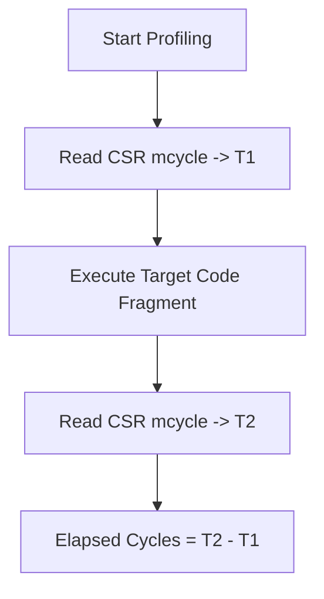
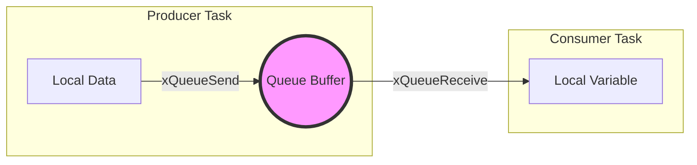
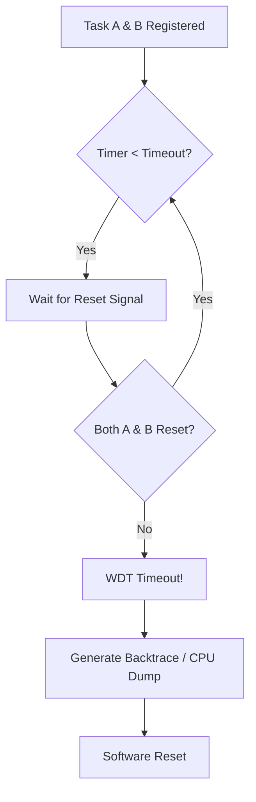
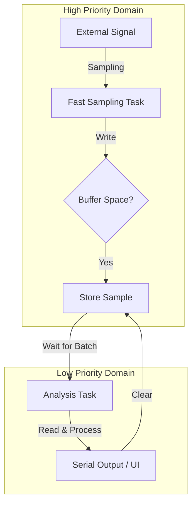

# ESP32-C3 Super Mini: ESP-IDF Embedded Engineering Guide

이 저장소는 ESP32-C3 Super Mini 보드를 활용한 **ESP-IDF** 기반 임베디드 시스템 설계 및 디버깅 가이드입니다. 총 11개의 핵심 예제를 통해 RISC-V 아키텍처, FreeRTOS, 그리고 시스템 안정성 및 성능 최적화 기법을 학습합니다.

---

## 0. 하드웨어 사양 (ESP32-C3 Super Mini)

| 항목 | 상세 사양 | 비고 |
| :--- | :--- | :--- |
| **CPU** | RISC-V 32-bit Single-core | Max 160MHz |
| **Memory** | 400KB SRAM / 4MB Flash | |
| **USB** | Internal USB-Serial/JTAG | GPIO 18(D-), 19(D+) |
| **Wireless** | Wi-Fi 4 + Bluetooth 5 (LE) | |
| **Pinout** | 13x GPIO, 3x ADC, 1x I2C, 1x SPI | |

---

## Technical Details
- **Framework**: ESP-IDF (C Language).
- **Hardware**: ESP32-C3 (RISC-V Single-core).
- **Core Controller**: Built-in USB-Serial/JTAG.

## 빌드 및 실행 (ESP-IDF CLI)
각 예제 디렉토리에서 아래 명령어를 사용합니다.

```bash
# 타겟 설정 (최초 1회)
idf.py set-target esp32c3

# 빌드, 플래싱 및 모니터링
idf.py build flash monitor
```

---

## 1. Machine CSR Access (RISC-V 아키텍처 심화)

### 1.1 RISC-V CSR(Control and Status Registers) 개요
RISC-V 아키텍처에서 CSR은 프로세서의 핵심 제어 및 상태 정보를 담고 있는 특수 목적 레지스터입니다. ESP32-C3는 **Machine Mode**라는 최고 권한 모드에서 동작하며, 이 모드에서 접근 가능한 `m`으로 시작하는 CSR들을 통해 하드웨어의 로우레벨 정보를 직접 제어합니다.

### 1.2 핵심 디버깅 레지스터 상세 분석
- `mcycle`: Machine Cycle Counter (성능 측정용)
- `misa`: Machine ISA Register (지원 명령어 집합 정보)
- `minstret`: 실행 완료된 명령어 수 카운트

### 1.3 mcycle을 활용한 정밀 성능 측정 메커니즘


---

## 4. FreeRTOS Queues (안전한 태스크 간 데이터 통신)

### 4.1 큐(Queue)의 핵심 개념
커널이 관리하는 FIFO(First-In, First-Out) 버퍼로, 접근 시 원자성(Atomicity)을 보장하여 안전한 통신 통로를 제공합니다.

### 4.5 큐 설계 시각화 (수정됨)

*참고: 큐 버퍼는 커널에 의해 관리되는 Thread-Safe FIFO 영역입니다.*

---

## 5. Task Watchdog Timer (TWDT: 시스템 안정성 및 자가 회복)

### 5.3 Task WDT의 동작 원리: 구독(Subscription) 모델
TWDT는 단순히 하나의 타이머가 아니라, 여러 태스크를 동시에 감시할 수 있는 "구독형" 서비스입니다.



---

## 11. Software Logic Analyzer (종합 프로젝트: 실시간 데이터 획득 시스템)

### 11.3 데이터 흐름 시각화

