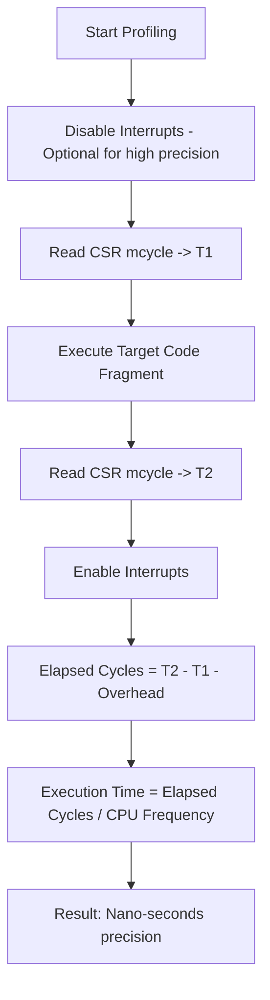

# ESP32-C3 Super Mini: Embedded Engineering Guide

이 문서는 ESP32-C3 Super Mini 보드를 활용한 임베디드 시스템 설계 및 디버깅 가이드입니다. 총 11개의 핵심 예제를 통해 RISC-V 아키텍처, FreeRTOS, 그리고 시스템 안정성 및 성능 최적화 기법을 학습합니다.

---

## 0. 하드웨어 사양 (ESP32-C3 Super Mini)

| 항목 | 상세 사양 | 비고 |
| :--- | :--- | :--- |
| **CPU** | RISC-V 32-bit Single-core | Max 160MHz |
| **Memory** | 400KB SRAM / 4MB Flash | |
| **USB** | Internal USB-Serial/JTAG | GPIO 18(D-), 19(D+) |
| **Wireless** | Wi-Fi 4 + Bluetooth 5 (LE) | |
| **Pinout** | 13x GPIO, 3x ADC, 1x I2C, 1x SPI | |

---

## Technical Details
- **Language**: Standard C++ (using Arduino Framework for hardware abstraction).
- **File Format**: `.cpp` (Standard C++ files with manual prototype declarations).
- **Hardware**: ESP32-C3 (RISC-V Single-core).
- **Core Controller**: Built-in USB-Serial/JTAG.

## Compilation
Even with `.cpp` files, you can compile using `arduino-cli`.
```bash
# General build command
arduino-cli compile --fqbn esp32:esp32:esp32c3 examples/<folder_name>/<file_name>.cpp
```

---

## 1. Machine CSR Access (RISC-V 아키텍처 심화)

### 1.1 RISC-V CSR(Control and Status Registers) 개요
RISC-V 아키텍처에서 CSR은 프로세서의 핵심 제어 및 상태 정보를 담고 있는 특수 목적 레지스터입니다. 일반적인 범용 레지스터(x0~x31)와는 별도의 주소 공간(12비트 주소, 총 4096개 가능)을 가지며, 전용 명령어인 `CSRRR`, `CSRRW`, `CSRRS`, `CSRRC` 등을 통해서만 접근할 수 있습니다.

ESP32-C3는 **Machine Mode**라는 최고 권한 모드에서 동작하며, 이 모드에서 접근 가능한 `m`으로 시작하는 CSR들을 통해 하드웨어의 로우레벨 정보를 직접 제어합니다.

### 1.2 핵심 디버깅 레지스터 상세 분석

| 레지스터 주소 | 이름 | 설명 및 용도 |
| :--- | :--- | :--- |
| `0xB00` | `mcycle` | **Machine Cycle Counter**: 하드웨어 리셋 이후 발생한 클록 사이클의 하위 32비트를 카운트합니다. 코드의 실행 효율을 사이클 단위로 정밀 분석할 때 필수적입니다. |
| `0xB80` | `mcycleh` | `mcycle`의 상위 32비트입니다. 32비트 CPU에서 64비트 카운터 값을 읽기 위해 사용됩니다. |
| `0x301` | `misa` | **Machine ISA Register**: 현재 CPU가 지원하는 명령어 집합(Instruction Set Architecture) 정보를 담고 있습니다. |
| `0xB02` | `minstret` | **Machine Instructions Retired**: 실제로 성공적으로 실행 완료된 명령어의 수를 카운트합니다. 파이프라인 효율 분석에 사용됩니다. |
| `0xF14` | `mhartid` | **Hardware Thread ID**: 현재 코어의 ID를 나타냅니다. (ESP32-C3는 싱글코어이므로 항상 0) |

### 1.3 mcycle을 활용한 정밀 성능 측정 메커니즘
일반적인 `micros()` 함수는 하드웨어 타이머 인터럽트를 기반으로 동작하므로 오차가 발생할 수 있습니다. 반면 `mcycle`은 CPU 클록과 1:1로 동기화되어 있어 가장 정밀한 측정이 가능합니다.

#### 성능 측정 흐름도 (Detailed)


---

[... 상세 내용은 기존과 동일하므로 생략하거나 필요한 부분만 포함 ...]

---

## 11. Software Logic Analyzer (종합 프로젝트: 실시간 데이터 획득 시스템)

[... 상세 내용은 기존과 동일 ...]
