# ESP32-C3 Super Mini: Embedded Engineering Guide

이 문서는 ESP32-C3 Super Mini 보드를 활용한 임베디드 시스템 설계 및 디버깅 가이드입니다. 총 6개의 핵심 기능을 통해 RISC-V 아키텍처와 FreeRTOS, 그리고 시스템 안정성 설계 기법을 학습합니다.

---

## 0. 하드웨어 사양 (ESP32-C3 Super Mini)

| 항목 | 상세 사양 | 비고 |
| :--- | :--- | :--- |
| **CPU** | RISC-V 32-bit Single-core | Max 160MHz |
| **Memory** | 400KB SRAM / 4MB Flash | |
| **USB** | Internal USB-Serial/JTAG | GPIO 18(D-), 19(D+) |
| **Wireless** | Wi-Fi 4 + Bluetooth 5 (LE) | |
| **Pinout** | 13x GPIO, 3x ADC, 1x I2C, 1x SPI | |

---

## 1. Machine CSR Access (RISC-V 아키텍처 심화)

### 1.1 RISC-V CSR(Control and Status Registers) 개요
RISC-V 아키텍처에서 CSR은 프로세서의 핵심 제어 및 상태 정보를 담고 있는 특수 목적 레지스터입니다. 일반적인 범용 레지스터(x0~x31)와는 별도의 주소 공간(12비트 주소, 총 4096개 가능)을 가지며, 전용 명령어인 `CSRRR`, `CSRRW`, `CSRRS`, `CSRRC` 등을 통해서만 접근할 수 있습니다.

ESP32-C3는 **Machine Mode**라는 최고 권한 모드에서 동작하며, 이 모드에서 접근 가능한 `m`으로 시작하는 CSR들을 통해 하드웨어의 로우레벨 정보를 직접 제어합니다.

### 1.2 핵심 디버깅 레지스터 상세 분석

| 레지스터 주소 | 이름 | 설명 및 용도 |
| :--- | :--- | :--- |
| `0xB00` | `mcycle` | **Machine Cycle Counter**: 하드웨어 리셋 이후 발생한 클록 사이클의 하위 32비트를 카운트합니다. 코드의 실행 효율을 사이클 단위로 정밀 분석할 때 필수적입니다. |
| `0xB80` | `mcycleh` | `mcycle`의 상위 32비트입니다. 32비트 CPU에서 64비트 카운터 값을 읽기 위해 사용됩니다. |
| `0x301` | `misa` | **Machine ISA Register**: 현재 CPU가 지원하는 명령어 집합(Instruction Set Architecture) 정보를 담고 있습니다. |
| `0xB02` | `minstret` | **Machine Instructions Retired**: 실제로 성공적으로 실행 완료된 명령어의 수를 카운트합니다. 파이프라인 효율 분석에 사용됩니다. |
| `0xF14` | `mhartid` | **Hardware Thread ID**: 현재 코어의 ID를 나타냅니다. (ESP32-C3는 싱글코어이므로 항상 0) |

### 1.3 mcycle을 활용한 정밀 성능 측정 메커니즘
일반적인 `micros()` 함수는 하드웨어 타이머 인터럽트를 기반으로 동작하므로 오차가 발생할 수 있습니다. 반면 `mcycle`은 CPU 클록과 1:1로 동기화되어 있어 가장 정밀한 측정이 가능합니다.

#### 성능 측정 흐름도 (Detailed)
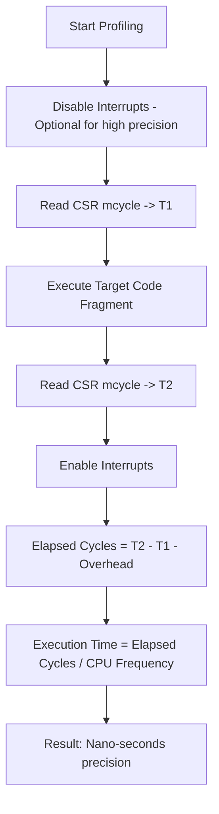

### 1.4 인라인 어셈블리(Inline Assembly) 심층 이해
C/C++ 코드 내에서 CSR에 접근하려면 GCC의 확장 인라인 어셈블리 문법을 사용해야 합니다.

```cpp
uint32_t count;
__asm__ __volatile__ (
    "csrr %0, mcycle"  // 명령어: Read CSR mcycle into output operand 0
    : "=r"(count)      // Output operand: %0은 count 변수에 매핑됨 (r: register)
    :                  // Input operands: 없음
    : "memory"         // Clobbers: 메모리 배리어를 설정하여 컴파일러 최적화 방지
);
```
*   `__volatile__`: 컴파일러가 이 코드를 최적화 과정에서 삭제하거나 위치를 옮기지 않도록 강제합니다.
*   `csrr`: CSR Read 전용 의사 명령어(Pseudo-instruction)입니다.

### 1.5 64비트 카운터 처리 (32비트 환경)
ESP32-C3는 32비트 CPU이므로 `mcycle`은 약 26초(160MHz 기준)면 오버플로우가 발생합니다. 더 긴 시간 측정을 위해서는 상위 레지스터인 `mcycleh`를 조합해야 합니다.

**64비트 읽기 알고리즘:**
1. `mcycleh`를 읽음 (H1)
2. `mcycle`을 읽음 (L)
3. 다시 `mcycleh`를 읽음 (H2)
4. H1과 H2가 같다면 (H1 << 32 | L) 반환. 다르다면 1번부터 반복 (읽는 도중 하위 비트에서 상위 비트로 캐리(Carry)가 발생한 경우 대비)

### 1.6 실무 활용 예시
*   **알고리즘 최적화**: 특정 수식 계산이 몇 사이클을 소모하는지 비교하여 최적의 알고리즘 선택.
*   **I/O 응답 속도 측정**: `digitalWrite`가 호출된 후 실제 핀 전압이 변하기까지의 사이클 수 계산.
*   **인터럽트 지연 시간(Latency) 분석**: 하드웨어 이벤트 발생 후 인터럽트 서비스 루틴(ISR)에 진입하기까지의 소요 사이클 측정.


---

## 2. UART & Internal USB-Serial/JTAG (하드웨어 디버깅 핵심)

### 2.1 통합 컨트롤러의 혁신
과거의 ESP32나 다른 MCU들은 PC와 통신하기 위해 외부 USB-to-UART 칩(예: CP2102, CH340)이 필요했습니다. 하지만 ESP32-C3는 **내장 USB-Serial/JTAG Controller**를 탑재하여, USB D+/D- 선을 칩의 GPIO 18/19에 직접 연결하는 것만으로 두 가지 강력한 기능을 동시에 수행합니다.

1.  **USB-Serial (CDC)**: 표준 시리얼 포트로 인식되어 `Serial.print()` 및 펌웨어 다운로드에 사용됩니다.
2.  **USB-JTAG**: 별도의 하드웨어 디버거(ESP-Prog 등) 없이 GDB를 통한 실시간 하드웨어 디버깅을 지원합니다.

### 2.2 내부 구조 및 신호 흐름
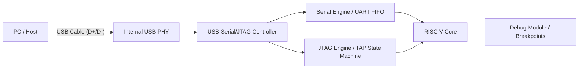

### 2.3 인터페이스 비교 및 선택 가이드

| 비교 항목 | 내장 USB-Serial/JTAG | 하드웨어 UART0 |
| :--- | :--- | :--- |
| **물리적 핀** | GPIO 18 (D-), 19 (D+) | GPIO 20 (RX), 21 (TX) |
| **속도** | USB Full Speed (12Mbps) | 보드 레이트 설정에 의존 (최대 5Mbps) |
| **장점** | 추가 부품 불필요, JTAG 디버깅 가능 | 부팅 로그(ROM Bootloader) 고정 출력 |
| **단점** | Deep Sleep 시 USB 연결 끊김 | 외부 USB-TTL 컨버터 필수 |
| **추천 용도** | 일반적인 개발 및 실시간 디버깅 | 외부 통신 모듈(GPS, GSM) 연동 |

### 2.4 JTAG 디버깅 워크플로우
내장 컨트롤러를 통해 소스 코드의 특정 라인에서 멈추거나 변수 값을 실시간으로 수정할 수 있습니다.

1.  **OpenOCD 실행**: `openocd -f board/esp32c3-builtin.cfg` 명령으로 PC와 C3 간의 디버그 채널을 엽니다.
2.  **GDB 연결**: `riscv32-esp-elf-gdb`를 실행하여 OpenOCD 서버에 접속합니다.
3.  **동작 제어**:
    *   `break setup`: `setup()` 함수 시작점에 중단점 설정.
    *   `continue`: 프로그램 실행.
    *   `print var_name`: 변수 값 확인.

### 2.5 하드웨어 연결 주의사항
*   **직결 가능**: ESP32-C3 Super Mini 보드는 대개 USB 커넥터가 이 핀들에 이미 연결되어 있습니다.
*   **전압 레벨**: USB D+/D- 신호는 표준 USB 레벨을 따르며, 내부 PHY가 이를 처리합니다.
*   **GPIO 제약**: USB 기능을 사용할 때 GPIO 18, 19는 일반 I/O로 사용하지 않는 것이 권장됩니다. 만약 일반 I/O로 재정의하면 USB 연결이 끊겨 펌웨어 업로드가 어려워질 수 있습니다. (이 경우 Boot 버튼을 누른 채 리셋하여 다운로드 모드 진입 필요)

### 2.6 실무 디버깅 팁
*   **Serial.flush()**: 시스템 패닉 발생 직전의 로그를 확인하려면 `Serial.flush()`를 호출하여 버퍼의 데이터를 강제로 전송해야 합니다.
*   **에코백(Echo-back) 테스트**: `Serial.available()`과 `Serial.read()`를 조합하여 터미널과의 통신 상태를 상시 점검하는 루틴을 포함하는 것이 좋습니다.

---

## 3. FreeRTOS Tasks (싱글 코어 멀티태스킹 전략)

### 3.1 ESP32-C3와 싱글 코어 FreeRTOS
전형적인 ESP32(듀얼 코어)와 달리, ESP32-C3는 **단일 RISC-V 코어**를 가집니다. 이는 동시에 물리적으로 두 개의 코드가 실행될 수 없음을 의미하며, FreeRTOS 스케줄러가 매우 짧은 시간 간격으로 CPU 점유권을 태스크 간에 교체(Context Switching)하여 마치 동시에 돌아가는 것처럼 보이게 합니다.

### 3.2 선점형 스케줄링(Preemptive Scheduling) 상세
FreeRTOS는 기본적으로 우선순위 기반 선점형 스케줄링을 사용합니다.

*   **Tick Interrupt**: 하드웨어 타이머가 주기적(기본 1ms)으로 인터럽트를 발생시켜 스케줄러를 깨웁니다.
*   **Context Switching**: 현재 실행 중인 태스크의 레지스터 상태를 스택에 저장하고, 다음 우선순위 태스크의 상태를 복구합니다.
*   **Starvation (기아 현상)**: 높은 우선순위의 태스크가 CPU를 양보(`vTaskDelay` 등)하지 않으면, 낮은 우선순위 태스크는 영원히 실행되지 못할 수 있습니다.

### 3.3 태스크 제어 블록(TCB)과 메모리 구조
각 태스크는 커널 내부에서 **TCB (Task Control Block)**로 관리됩니다.

| 항목 | 설명 | 관리 위치 |
| :--- | :--- | :--- |
| **Stack** | 로컬 변수, 함수 호출 기록, ISR 복귀 주소 저장 | RAM (Heap 할당) |
| **Priority** | 0(IDLE) ~ configMAX_PRIORITIES-1 | TCB 내 저장 |
| **State** | Ready, Running, Blocked, Suspended | 커널 리스트에서 관리 |
| **Handle** | 태스크 제어를 위한 포인터 | 사용자 코드 변수 |

### 3.4 실전 태스크 설계 패턴
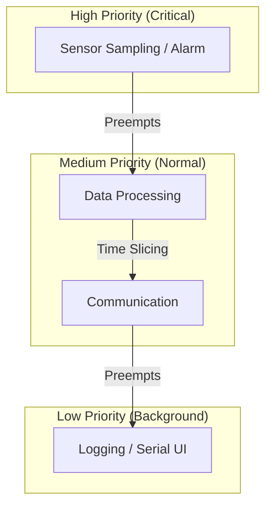

### 3.5 스택 사이즈 최적화 및 디버깅
ESP32-C3는 RAM이 400KB로 제한적이므로 무분별한 스택 할당은 위험합니다.

1.  **High Water Mark**: `uxTaskGetStackHighWaterMark()` 함수를 사용하여 태스크 실행 중 남은 최소 스택 공간을 확인합니다. 0에 가까워지면 `Stack Overflow`가 발생합니다.
2.  **Stack Overflow Hook**: `FreeRTOSConfig.h`에 설정된 훅 함수를 통해 오버플로우 발생 시 즉시 감지하고 로그를 남길 수 있습니다.

### 3.6 싱글 코어 주의사항: Critical Sections
싱글 코어에서는 인터럽트를 비활성화하는 것만으로 완벽한 **Critical Section**을 만들 수 있습니다. 듀얼 코어에서 사용하는 `Spinlock`은 필요하지 않지만, ISR(Interrupt Service Routine)과 태스크 간 공유 변수 접근 시에는 반드시 `portENTER_CRITICAL()` 등을 사용하여 원자성(Atomicity)을 보장해야 합니다.

### 3.7 주요 API 심화 활용
*   **vTaskDelay vs delayMicroseconds**: `vTaskDelay`는 CPU 점유권을 반납하고 Blocked 상태로 들어가지만, `delayMicroseconds`는 CPU를 붙잡고 있는 Busy-waiting 방식입니다. RTOS 환경에서는 가급적 전자를 사용해야 시스템 효율이 높아집니다.
*   **vTaskDelete(NULL)**: 태스크가 자신의 할 일을 끝내면 반드시 자기 자신을 삭제하여 할당된 메모리를 해제해야 합니다.

---

## 4. FreeRTOS Queues (안전한 태스크 간 데이터 통신)

### 4.1 큐(Queue)의 핵심 개념과 필요성
멀티태스킹 환경에서 두 태스크가 공유 변수(Global Variable)를 통해 데이터를 주고받으면, 한 태스크가 데이터를 쓰는 도중에 다른 태스크가 이를 읽으려 할 때 **데이터 부패(Data Corruption)**가 발생할 수 있습니다. FreeRTOS 큐는 커널이 관리하는 FIFO(First-In, First-Out) 버퍼로, 접근 시 원자성(Atomicity)을 보장하여 안전한 통신 통로를 제공합니다.

### 4.2 데이터 전달 방식: Pass-by-Copy
FreeRTOS 큐는 데이터를 **복사(Copy)**하여 저장합니다.

*   **동작 방식**: 데이터를 보낼 때 송신자 태스크의 로컬 변수 값이 큐 버퍼로 복사되고, 수신자 태스크가 읽을 때 다시 큐 버퍼에서 수신자의 로컬 변수로 복사됩니다.
*   **장점**: 송신 태스크가 데이터를 보낸 직후 해당 변수를 수정하거나 파괴해도 큐에 저장된 데이터는 안전합니다. (포인터만 보내는 경우 발생할 수 있는 메모리 해제 이슈 방지)
*   **주의**: 매우 큰 구조체(예: 1KB 이상의 배열)를 통째로 큐에 넣으면 복사 비용(CPU 사이클)이 커지므로, 이런 경우엔 데이터가 담긴 버퍼의 **포인터**만 큐로 전달하는 방식을 권장합니다.

### 4.3 큐의 상태와 블로킹(Blocking) 메커니즘
큐는 송수신 시 대기 시간(Ticks to Wait)을 설정할 수 있습니다.

| 상태 | 설명 | 태스크 동작 |
| :--- | :--- | :--- |
| **Queue Full** | 큐가 가득 참 | 송신 태스크는 지정된 시간 동안 `Blocked` 상태로 대기하거나 포기 |
| **Queue Empty** | 큐가 비어 있음 | 수신 태스크는 데이터가 들어올 때까지 `Blocked` 상태로 대기 |
| **Available** | 데이터가 존재함 | 수신 태스크가 즉시 데이터를 가져가고 실행 지속 |

### 4.4 ISR(인터럽트)에서의 큐 사용 주의사항
인터럽트 서비스 루틴(ISR) 내에서는 일반 `xQueueSend` 함수를 사용할 수 없습니다. ISR은 스케줄러를 멈추거나 대기(Block)할 수 없기 때문입니다.

*   **FromISR 계열 함수**: `xQueueSendFromISR`, `xQueueReceiveFromISR`를 사용해야 합니다.
*   **Yield Request**: ISR에서 높은 우선순위 태스크를 깨웠다면, ISR 종료 시 `portYIELD_FROM_ISR()`를 호출하여 즉시 컨텍스트 스위칭이 일어나도록 유도해야 합니다.

### 4.5 큐 설계 시각화
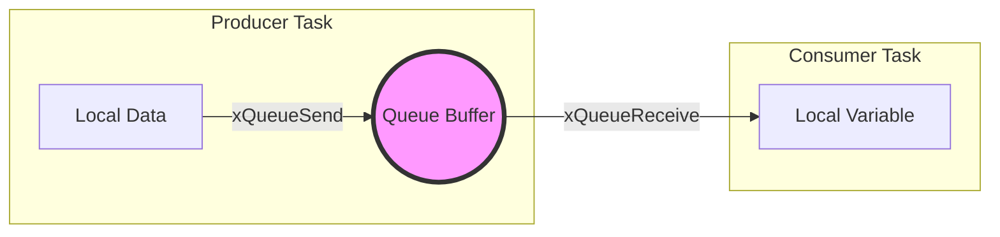

### 4.6 실무 설계 팁: 데이터 구조체 설계
복잡한 시스템에서는 단순히 정수(int)를 보내는 대신, 데이터 타입과 값을 포함한 구조체를 정의하여 사용합니다.

```cpp
typedef struct {
    uint8_t sensor_id;
    float value;
    uint32_t timestamp;
} SensorData_t;

// 큐 생성 예시
QueueHandle_t xQueue = xQueueCreate(10, sizeof(SensorData_t));
```

이렇게 하면 하나의 수신 태스크가 여러 종류의 센서 데이터를 효율적으로 식별하고 처리할 수 있습니다.

---

## 5. Task Watchdog Timer (TWDT: 시스템 안정성 및 자가 회복)

### 5.1 왜 와치독(Watchdog)이 필요한가?
임베디드 시스템은 24시간 365일 중단 없이 동작해야 합니다. 하지만 예기치 못한 하드웨어 노이즈, 메모리 누수, 혹은 잘못된 논리 루프로 인한 **데드락(Deadlock)** 상태에 빠질 수 있습니다. 와치독은 시스템의 생존 여부를 감시하다가, 정해진 시간 내에 "생존 신호(Feeding)"가 오지 않으면 강제로 하드웨어를 리셋시켜 시스템을 초기화합니다.

### 5.2 ESP32-C3의 와치독 계층 구조
ESP32-C3에는 여러 단계의 보호막이 존재합니다.

| 종류 | 감시 대상 | 동작 결과 |
| :--- | :--- | :--- |
| **MWDT (Main WDT)** | 하드웨어 타이머 / 시스템 전체 | 하드웨어 강제 리셋 |
| **TWDT (Task WDT)** | 개별 FreeRTOS 태스크 | 패닉 리포트 출력 후 리셋 (선택 가능) |
| **RTC WDT** | 저전력 모드 / 핵심 시스템 | 최후의 수단으로 시스템 완전 재시작 |

### 5.3 Task WDT의 동작 원리: 구독(Subscription) 모델
TWDT는 단순히 하나의 타이머가 아니라, 여러 태스크를 동시에 감시할 수 있는 "구독형" 서비스입니다.

1.  **초기화**: TWDT 서비스 시작 및 타임아웃 시간(예: 5초) 설정.
2.  **구독**: 감시가 필요한 중요한 태스크들이 자기 자신을 TWDT에 등록(`esp_task_wdt_add`).
3.  **체크인**: 각 태스크는 루프를 돌 때마다 "나 살아있음"을 알림(`esp_task_wdt_reset`).
4.  **심판**: **모든** 등록된 태스크가 제시간에 체크인해야만 타이머가 초기화됩니다. 단 하나라도 늦으면 시스템은 장애로 판단합니다.

### 5.4 시스템 장애 진단 플로우
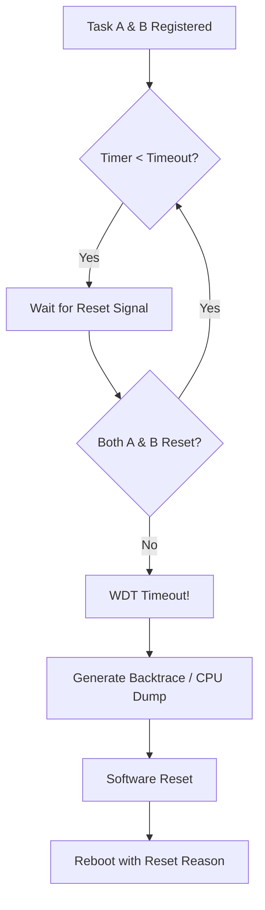

### 5.5 패닉 핸들링과 디버깅 (Panic Report)
WDT에 의해 리셋이 발생하면, ESP32-C3는 부팅 직후 시리얼 포트를 통해 **Backtrace** 정보를 쏟아냅니다.

*   **Guru Meditation Error**: 시스템 패닉 상태를 알리는 메시지입니다.
*   **Reason: Task Watchdog got triggered**: 어떤 사유로 리셋되었는지 명시합니다.
*   **PC (Program Counter)**: 리셋 직전에 CPU가 실행 중이던 코드 주소입니다. 이를 통해 어떤 함수의 어떤 줄에서 무한 루프가 발생했는지 역추적할 수 있습니다.

### 5.6 실무 설계 권장사항
*   **우선순위 고려**: 낮은 우선순위 태스크가 CPU를 점유하지 못해 WDT가 터지는 경우가 많습니다. 높은 우선순위 태스크에는 반드시 `vTaskDelay`를 적절히 배치해야 합니다.
*   **핵심 작업만 감시**: UI 업데이트나 로그 출력 같은 비핵심 작업은 WDT 감시 대상에서 제외하여 불필요한 리셋을 방지합니다.
*   **I/O 차단 방지**: 외부 센서 응답을 무한정 기다리는 코드(`while(wait_sensor)`)는 반드시 타임아웃 처리를 하여 WDT가 작동하기 전에 스스로 복구하게 해야 합니다.

---

## 6. Low Power & Deep Sleep (저전력 설계와 에너지 최적화)

### 6.1 임베디드 에너지 관리의 핵심: 전력 도메인
ESP32-C3는 전력 효율을 극대화하기 위해 시스템을 여러 개의 **전력 도메인(Power Domains)**으로 분리하여 설계되었습니다. 가장 중요한 개념은 **System Domain**과 **RTC Domain**의 분리입니다.

*   **System Domain**: CPU, RAM, 대부분의 디지털 주변장치(SPI, I2C, Wi-Fi 등)를 포함합니다.
*   **RTC Domain**: 초저전력 타이머, RTC 컨트롤러, 그리고 슬립 중에도 데이터를 저장할 수 있는 소량의 **RTC RAM**을 포함합니다.

### 6.2 슬립 모드별 상세 비교

| 모드 | CPU | Wi-Fi/BT | RTC 도메인 | 전력 소모 (Typ.) | 복구 방식 |
| :--- | :--- | :--- | :--- | :--- | :--- |
| **Active** | ON | ON | ON | 20 ~ 130 mA | - |
| **Modem-sleep** | ON | OFF | ON | 15 ~ 25 mA | 즉시 활성화 |
| **Light-sleep** | Pause | OFF | ON | 0.3 ~ 0.8 mA | 실행 지점부터 재개 |
| **Deep-sleep** | OFF | OFF | ON | **5 ~ 10 μA** | **시스템 리셋(Reset)** |
| **Hibernation** | OFF | OFF | Only Timer | 1 ~ 3 μA | 시스템 리셋 |

### 6.3 Deep Sleep 메커니즘과 부트 시퀀스
Deep Sleep은 단순히 전원을 끄는 것이 아니라, 시스템의 상태를 최소한으로 유지하며 "잠드는" 과정입니다.

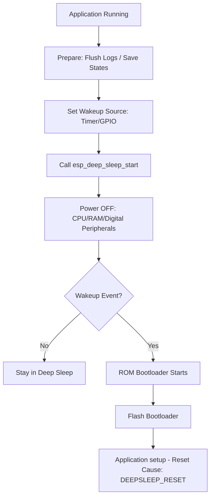

### 6.4 데이터 유지 전략: RTC 메모리 활용
Deep Sleep에 진입하면 일반 SRAM의 모든 데이터는 소실됩니다. 하지만 잠에서 깨어났을 때 이전의 상태(예: 센서 데이터 카운트, 네트워크 연결 정보)를 유지해야 할 경우가 있습니다.

*   **RTC DATA ATTR**: `RTC_DATA_ATTR` 속성을 변수 선언 시 사용하면, 해당 변수는 RTC RAM에 배치되어 슬립 중에도 값이 보존됩니다.
    ```cpp
    RTC_DATA_ATTR int bootCount = 0; // 슬립 후에도 초기화되지 않음
    ```
*   **외부 플래시 저장**: 데이터량이 많거나 전원이 완전히 차단될 가능성이 있다면 **NVS (Non-volatile Storage)**를 사용하여 플래시 메모리에 영구 저장해야 합니다.

### 6.5 웨이크업 소스(Wakeup Sources)
1.  **Timer Wakeup**: 가장 일반적인 방식으로, 설정된 시간이 지나면 깨어납니다. (us 단위 설정)
2.  **GPIO Wakeup**: 버튼 클릭이나 센서 신호(High/Low)를 감지하여 깨어납니다. (ESP32-C3는 특정 RTC GPIO 핀 사용 가능)

### 6.6 저전력 설계 실무 팁
*   **Floating Pins 방지**: 슬립 진입 전 GPIO 상태가 플로팅(Floating)되지 않도록 풀업/풀다운 설정을 명확히 해야 누설 전류를 막을 수 있습니다.
*   **Peripherals 종료**: 외부 센서나 디스플레이 전원을 제어할 수 있는 FET 회로를 구성하고, 슬립 전 반드시 OFF 신호를 주어야 합니다.
*   **Serial Flush**: 슬립 진입 직전에 로그를 남기려면 반드시 `Serial.flush()`를 호출하여 UART FIFO 버퍼가 비워질 때까지 기다려야 합니다. 그렇지 않으면 로그가 잘린 채 잠들게 됩니다.

---

---

## 7. Race Condition & Mutex (공유 자원 경합과 상호 배제)

### 7.1 데이터 부패의 근본 원인: Race Condition
많은 엔지니어들이 "싱글 코어에서는 한 번에 하나의 코드만 실행되니 경합(Race)이 발생하지 않는다"고 오해합니다. 하지만 FreeRTOS와 같은 멀티태스킹 환경에서는 **타임 슬라이싱(Time-slicing)**에 의해 어느 시점에서든 컨텍스트 스위칭이 발생할 수 있습니다. 

특히 `count++`와 같은 "Read-Modify-Write" 연산 도중에 태스크가 교체되면 데이터가 유실되는 현상이 발생합니다.

### 7.2 RISC-V 어셈블리 레벨 분석
`shared_counter++` 코드가 실제로 CPU에서 어떻게 실행되는지 RISC-V 명령어로 분해해 보면 그 위험성이 명확해집니다.

| 단계 | 명령어 | 역할 | 비고 |
| :--- | :--- | :--- | :--- |
| **1. Load** | `lw a5, 0(s1)` | 메모리(RAM)의 변수 값을 CPU 레지스터(`a5`)로 로드 | |
| **2. Add** | `addi a5, a5, 1` | 레지스터 값을 1 증가 | **여기서 스위칭 발생 시 문제** |
| **3. Store** | `sw a5, 0(s1)` | 계산된 값을 다시 메모리(RAM)에 저장 | |

**장애 시나리오:**
1.  **태스크 A**가 1단계(Load)를 수행하여 레지스터에 `10`을 담음.
2.  **태스크 A**가 2단계(Add) 수행 직후 인터럽트에 의해 **태스크 B**로 교체됨.
3.  **태스크 B**가 `shared_counter`를 읽어 11로 만들고 저장함.
4.  다시 **태스크 A**가 복귀하여 자신의 레지스터 값(`11`)을 메모리에 씀.
5.  결과: 두 번 증가했어야 할 값이 `11`에 머무름 (**Data Loss**).

### 7.3 컨텍스트 스위칭 시각화
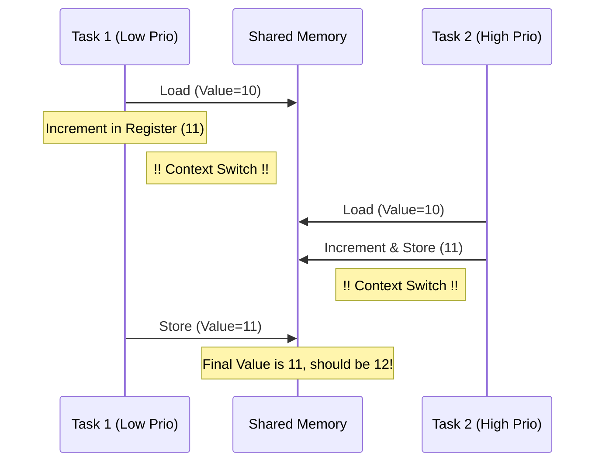

### 7.4 Mutex: 소프트웨어 기반 상호 배제
Mutex는 **"이 코드 구간은 한 번에 하나만 들어올 수 있다"**는 약속입니다. FreeRTOS 커널은 Mutex를 요청한 태스크가 이를 획득하지 못하면 즉시 `Blocked` 상태로 전환시켜 CPU 자원을 낭비하지 않게 관리합니다.

### 7.5 동기화 도구 비교

| 도구 | 특징 | 권장 용도 |
| :--- | :--- | :--- |
| **Mutex** | 소유권 개념, 우선순위 상속 지원 | 복잡한 공유 자원 보호 |
| **Binary Semaphore** | 소유권 없음, 단순히 신호 전달 | ISR에서 태스크 깨우기 |
| **Critical Section** | 인터럽트 자체를 비활성화 | 아주 짧은 코드 (몇 사이클) 보호 |
| **Atomic (C++11)** | CPU 하드웨어 명령어로 보호 | 단순 변수 증가/감소 |

### 7.6 실무 설계 가이드
*   **교착 상태(Deadlock) 방지**: 두 개 이상의 Mutex를 사용할 때는 항상 정해진 순서대로 획득해야 합니다.
*   **대기 시간 설정**: `portMAX_DELAY` 대신 적절한 타임아웃을 설정하여 시스템이 영원히 멈추는 것을 방지합니다.
*   **최소화된 임계 구역**: Mutex를 잡고 있는 시간(`Critical Section`)은 짧을수록 시스템 전체의 반응성(Responsiveness)이 좋아집니다.

---

## 8. Priority Inversion (우선순위 역전과 해결 전략)

### 8.1 임베디드 역사의 유명한 버그: 화성 탐사선 패스파인더
1997년 화성에 착륙한 패스파인더 호가 갑자기 리셋되는 현상이 발생했습니다. 원인은 바로 **우선순위 역전(Priority Inversion)** 때문이었습니다. 낮은 우선순위의 기상 관측 태스크가 공유 자원을 잡고 있는 동안, 중간 우선순위의 통신 태스크가 CPU를 점유해버려, 가장 중요한 버스 관리 태스크(High Priority)가 실행되지 못해 시스템이 중단된 사례입니다.

### 8.2 역전 현상의 발생 단계
싱글 코어 환경에서 세 개의 태스크가 있을 때 발생하는 전형적인 시나리오입니다.

1.  **Low Task**: 공유 자원(Mutex)을 획득하고 작업을 시작함.
2.  **High Task**: 실행 준비가 되어 Low Task를 선점(Preempt)하려 하지만, 자원이 Low Task에 있어 `Blocked` 상태로 대기함.
3.  **Mid Task**: 자원이 필요 없는 중간 우선순위 태스크가 등장하여 Low Task를 선점하고 CPU를 계속 사용함.
4.  **결과**: High Task는 자원이 해제되기만을 기다리는데, 정작 자원을 해제해야 할 Low Task가 Mid Task에 밀려 실행되지 못함. 결과적으로 **High가 Mid보다 늦게 실행되는 모순**이 발생합니다.

### 8.3 역전 현상 시뮬레이션 (Mermaid)
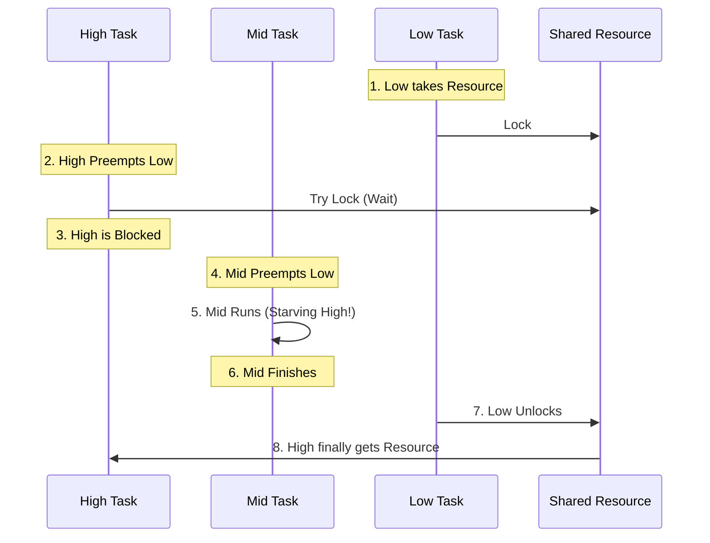

### 8.4 해결책: 우선순위 상속 (Priority Inheritance)
FreeRTOS의 Mutex는 이 문제를 방지하기 위한 알고리즘을 내장하고 있습니다.

*   **상속 동작**: 높은 우선순위 태스크가 자원을 기다리기 시작하면, 자원을 소유한 **낮은 우선순위 태스크의 등급을 일시적으로 최고 수준으로 격상**시킵니다.
*   **효과**: 격상된 Low Task는 Mid Task에 의해 선점되지 않고 빠르게 작업을 마친 뒤 자원을 반납할 수 있습니다. 자원을 반납하는 즉시 원래의 낮은 우선순위로 복구됩니다.

### 8.5 Mutex vs Binary Semaphore
이 둘의 가장 큰 차이점 중 하나가 바로 이 **우선순위 상속 지원 여부**입니다.

| 항목 | Mutex | Binary Semaphore |
| :--- | :--- | :--- |
| **우선순위 상속** | **지원함** (Inversion 방지) | 지원하지 않음 |
| **소유권 (Ownership)** | 있음 (준 태스크만 줄 수 있음) | 없음 (누구나 줄 수 있음) |
| **권장 용도** | 공유 자원 보호 (Critical Section) | 태스크 간 동기화, 신호 전달 |

### 8.6 엔지니어링 권장사항
*   **Mutex 사용**: 공유 데이터를 보호할 때는 반드시 Semaphore가 아닌 Mutex를 사용하십시오.
*   **임계 구역 최소화**: 우선순위 상속이 일어나더라도 시스템 전체의 실시간성은 저하됩니다. 자원을 잡고 있는 시간 자체를 줄이는 것이 최선입니다.
*   **설계 단순화**: 가급적 높은 우선순위 태스크와 낮은 우선순위 태스크가 자원을 공유하지 않도록 설계하는 것이 가장 안전합니다.

---

## 9. IRAM vs Flash Timing (하드웨어 가속과 실행 결정론)

### 9.1 하바드 아키텍처와 메모리 계층 구조
ESP32-C3의 RISC-V 코어는 명령어(Instruction)와 데이터(Data) 버스가 분리된 하바드 아키텍처를 따릅니다. 하지만 물리적인 실행 코드는 외부 **SPI Flash**에 저장되어 있으며, 이를 효율적으로 실행하기 위해 내부 **Instruction Cache (I-Cache)**를 거쳐 CPU로 전달됩니다.

### 9.2 Flash 실행의 비결정론적 특성 (Jitter)
Flash에서 직접 코드를 실행할 때(기본 방식), 성능은 캐시 상태에 의존합니다.

*   **Cache Hit**: CPU 클록과 거의 동일한 속도로 명령어 실행.
*   **Cache Miss**: SPI 버스를 통해 외부 Flash에서 데이터를 가져와야 하므로 수십 사이클 이상의 지연(Latency) 발생.
*   **문제점**: 인터럽트 응답이나 정밀 타이밍이 중요한 통신 프로토콜 실행 시, 캐시 상태에 따라 실행 시간이 들쭉날쭉해지는 **Jitter** 현상이 발생합니다.

### 9.3 IRAM (Internal RAM)의 역할
IRAM은 CPU 내부에 위치한 고속 SRAM입니다. 여기에 배치된 코드는 캐시를 거치지 않고 CPU와 직결되어 실행되므로, **결정론적(Deterministic) 실행 시간**을 보장합니다.

| 특성 | Flash 실행 (VFS/Cache) | IRAM 실행 |
| :--- | :--- | :--- |
| **속도** | 캐시 상태에 따라 가변적 | 항상 최고 속도 (Zero Wait-state) |
| **결정론** | 낮음 (예측 불가한 지연 발생 가능) | **높음 (항상 동일한 사이클 소요)** |
| **용량** | 최대 16MB (외부 Flash) | 약 400KB (SRAM 공유) |
| **전력 소모** | SPI 통신 및 캐시 작동으로 높음 | 내부 로직만 사용하여 낮음 |

### 9.4 IRAM_ATTR와 링커(Linker) 배치
`IRAM_ATTR` 속성을 함수 앞에 붙이면, 컴파일러와 링커는 해당 함수를 `.flash.text` 섹션이 아닌 `.iram1.text` 섹션에 배치합니다.

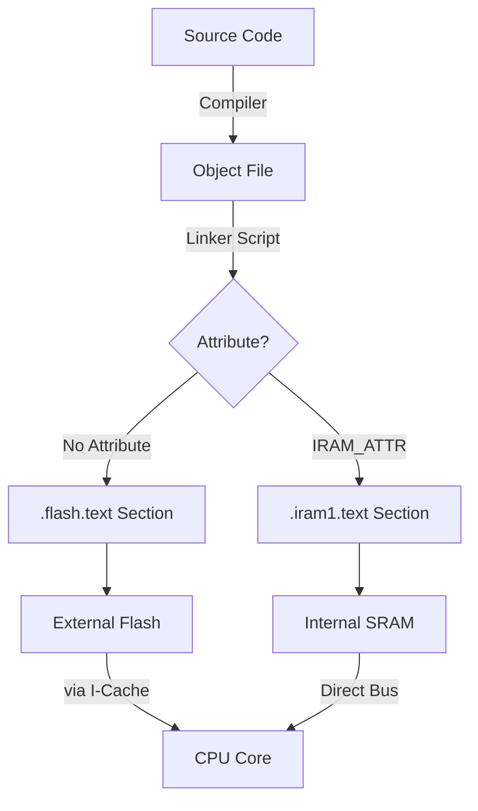

### 9.5 실무 활용 가이드: 무엇을 IRAM에 넣어야 하는가?
SRAM 용량은 제한적이므로 모든 코드를 IRAM에 넣을 수는 없습니다. 다음과 같은 경우에만 선별적으로 사용합니다.

1.  **ISR (인터럽트 서비스 루틴)**: 하드웨어 이벤트에 대해 즉각적이고 일정한 응답 속도가 필요한 경우.
2.  **Critical Timing Code**: Bit-banging 통신(예: WS2812 LED 제어)이나 정밀 PWM 제어.
3.  **Flash Write 중 실행 코드**: SPI Flash에 데이터를 쓰는 동안에는 Flash에서 코드를 읽어올 수 없습니다. 이 때 실행되어야 하는 코드는 반드시 IRAM에 있어야 시스템이 Crash되지 않습니다.

### 9.6 성능 측정 팁
`mcycle` 레지스터를 사용하여 두 방식의 차이를 정밀 분석할 수 있습니다.
*   **Flash**: 첫 번째 호출(Cache Miss)과 두 번째 호출(Cache Hit)의 사이클 차이가 큼.
*   **IRAM**: 매 호출마다 거의 동일한 사이클 소요.

---

## 10. ISR Latency (인터럽트 지연 시간과 실시간 응답성)

### 10.1 인터럽트 지연의 하드웨어적 정의
인터럽트 지연(Latency)은 외부 핀 신호 변화나 타이머 만료와 같은 하드웨어 이벤트가 발생한 순간부터, CPU가 해당 인터럽트를 처리하는 첫 번째 명령어(ISR의 Entry Point)를 실행하기까지 소요되는 시간을 의미합니다. 이는 시스템의 **실시간성(Real-time Responsiveness)**을 결정짓는 가장 중요한 지표입니다.

### 10.2 인터럽트 처리의 5단계 과정
이 지연 시간은 단순히 "점프"하는 시간이 아니라, 하드웨어와 소프트웨어가 협력하는 복잡한 단계를 거칩니다.

1.  **Signal Detection**: 하드웨어 핀에서 신호 변화를 감지 (약 1~2 사이클).
2.  **Interrupt Controller (PLIC)**: 신호가 인터럽트 컨트롤러로 전달되어 현재 실행 중인 코드보다 우선순위가 높은지 판단.
3.  **Pipeline Flush**: 현재 실행 중인 명령어를 강제로 중단하고 파이프라인을 비움.
4.  **Context Save**: 현재 CPU의 레지스터들(a0~a7, t0~t6 등)의 상태를 현재 태스크의 스택에 백업. (가장 많은 시간 소요)
5.  **Vector Jump**: 인터럽트 벡터 테이블을 참조하여 지정된 ISR 함수 주소로 점프.

### 10.3 지연 시간 시각화 (Detailed)
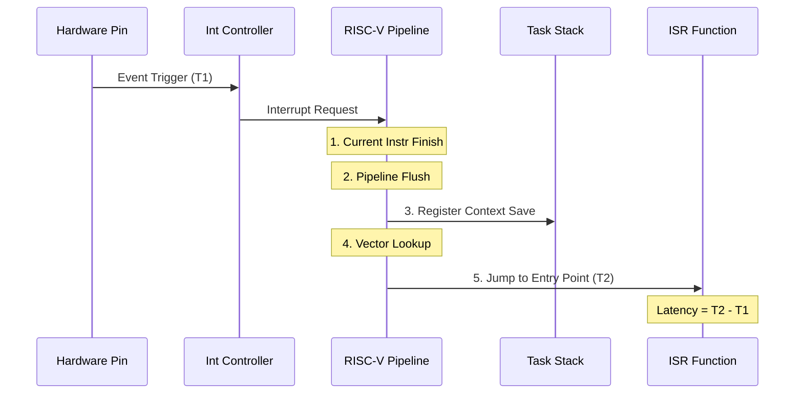

### 10.4 지연 시간을 증가시키는 요인 (Jitter)
모든 인터럽트 지연 시간이 항상 동일하지는 않으며, 다음과 같은 이유로 변동성(Jitter)이 발생합니다.

*   **Critical Sections**: 코드의 다른 부분에서 `portENTER_CRITICAL()` 등을 통해 인터럽트를 비활성화한 경우, 해당 구간이 끝날 때까지 인터럽트 처리가 지연됩니다.
*   **Instruction Cache Miss**: ISR 코드가 Flash에 있고 캐시에 로드되어 있지 않다면, 외부 Flash에서 코드를 가져오는 시간만큼 추가 지연이 발생합니다. (9번 섹션 참고)
*   **Nested Interrupts**: 더 높은 우선순위의 다른 인터럽트가 이미 실행 중인 경우, 해당 ISR이 종료될 때까지 대기해야 합니다.

### 10.5 지연 시간 최소화 체크리스트
극한의 실시간 응답성이 필요한 경우 다음을 준수해야 합니다.

1.  **IRAM_ATTR 사용**: ISR 함수를 IRAM에 배치하여 캐시 미스를 원천 차단합니다.
2.  **최소한의 컨텍스트 저장**: 가능하다면 레지스터 사용을 최소화하여 백업/복구 오버헤드를 줄입니다.
3.  **No Blocking in ISR**: ISR 내에서는 절대 `delay()`나 Mutex 대기 등 Block을 유발하는 코드를 넣지 않습니다.
4.  **우선순위 최적화**: 가장 응답이 빨라야 하는 하드웨어 인터럽트에 가장 높은 우선순위(Priority Level)를 부여합니다.

### 10.6 측정 팁: 소프트웨어 트리거
실제 보드에서는 외부 신호를 정확한 시점에 주기가 어렵습니다. 예제 코드처럼 특정 핀을 출력으로 설정하고 소프트웨어로 `digitalWrite()`를 수행한 직후 사이클을 측정하면, 하드웨어적 지연 시간을 매우 정밀하게 시뮬레이션할 수 있습니다.

---

## 11. Software Logic Analyzer (종합 프로젝트: 실시간 데이터 획득 시스템)

### 11.1 프로젝트 개요
본 프로젝트는 ESP32-C3의 고속 RISC-V 코어와 FreeRTOS의 우선순위 스케줄링을 결합하여, 외부 디지털 신호를 정밀하게 캡처하고 분석하는 **소프트웨어 기반 로직 분석기**를 구현합니다. 이는 "고속 데이터 생성(Producer)"과 "저속 데이터 처리(Consumer)"가 공존하는 전형적인 실시간 시스템의 축소판입니다.

### 11.2 이중 태스크 아키텍처 (Dual-Task Architecture)
시스템의 응답성을 보장하기 위해 역할을 엄격히 분리합니다.

| 태스크 | 이름 | 우선순위 | 역할 및 특징 |
| :--- | :--- | :--- | :--- |
| **High-Prio** | **Sampler** | 10 (Max) | 최단 주기로 GPIO를 샘플링하여 버퍼에 저장. IRAM에서 실행 권장. |
| **Low-Prio** | **Analyzer** | 1 (Min) | 버퍼가 가득 차면 데이터를 시리얼로 전송하거나 통계 계산. |

### 11.3 데이터 흐름 시각화
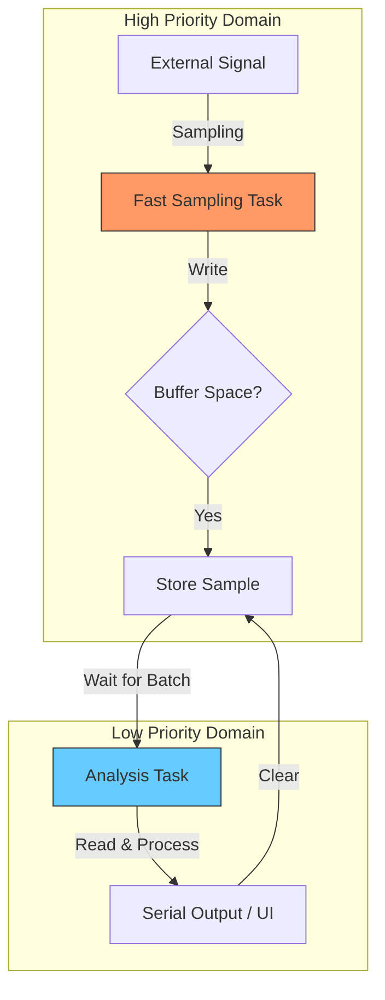

### 11.4 버퍼 관리 전략: Ring Buffer vs Ping-Pong Buffer
고속 데이터 전송 시 데이터 유실을 막기 위한 두 가지 전략입니다.

1.  **Ring Buffer (현재 예제 적용)**: 하나의 큰 원형 버퍼를 사용합니다. 쓰기 인덱스(Head)가 끝에 도달하면 다시 처음으로 돌아갑니다. 구현이 간단하지만, 분석 속도가 느리면 데이터가 덮어씌워질(Overwrite) 위험이 있습니다.
2.  **Ping-Pong Buffer (심화)**: 두 개의 버퍼(A, B)를 준비합니다. Sampler가 A에 쓰는 동안 Analyzer는 B를 처리합니다. A가 꽉 차면 역할을 교체합니다. 데이터 처리의 연속성을 보장하는 가장 확실한 방법입니다.

### 11.5 샘플링 주률과 CPU 부하의 트레이드오프
샘플링 빈도가 높을수록 신호의 정밀도는 올라가지만, 시스템 전체의 부하가 커집니다.

*   **Nyquist 이론**: 측정하고자 하는 신호 주파수의 최소 2배 이상으로 샘플링해야 신호 복원이 가능합니다.
*   **CPU 점유**: `delayMicroseconds(10)`을 사용한 100kHz 샘플링은 싱글 코어 CPU의 상당 부분을 점유합니다. 이 경우 Analyzer 태스크는 Sampler가 쉴 때만(버퍼가 찰 때까지 기다리는 등) 실행될 수 있습니다.

### 11.6 실무 최적화 기술
*   **Direct Register Access**: `digitalRead()`는 편리하지만 함수 호출 오버헤드가 있습니다. 더 높은 속도가 필요하다면 `GPIO.in` 레지스터를 직접 읽어 처리 시간을 단축할 수 있습니다.
*   **DMA 활용 (심화)**: ESP32-C3의 SPI나 I2S 컨트롤러를 "Parallel Mode"로 설정하면, CPU 개입 없이 하드웨어가 직접 GPIO 상태를 메모리로 쏟아붓게 할 수 있습니다. (최대 수십 MHz 샘플링 가능)
*   **Timestamping**: 단순 상태뿐만 아니라, `mcycle` 값을 함께 기록하면 신호의 지속 시간(Duration)을 나노초 단위로 분석할 수 있습니다.

### 11.7 학습 요약
이 프로젝트를 통해 다음을 마스터할 수 있습니다:
1.  태스크 간 우선순위 설계의 중요성.
2.  공유 버퍼를 통한 대량 데이터의 안전한 전달.
3.  하드웨어 한계치까지 시스템 성능을 끌어올리는 최적화 기법.
